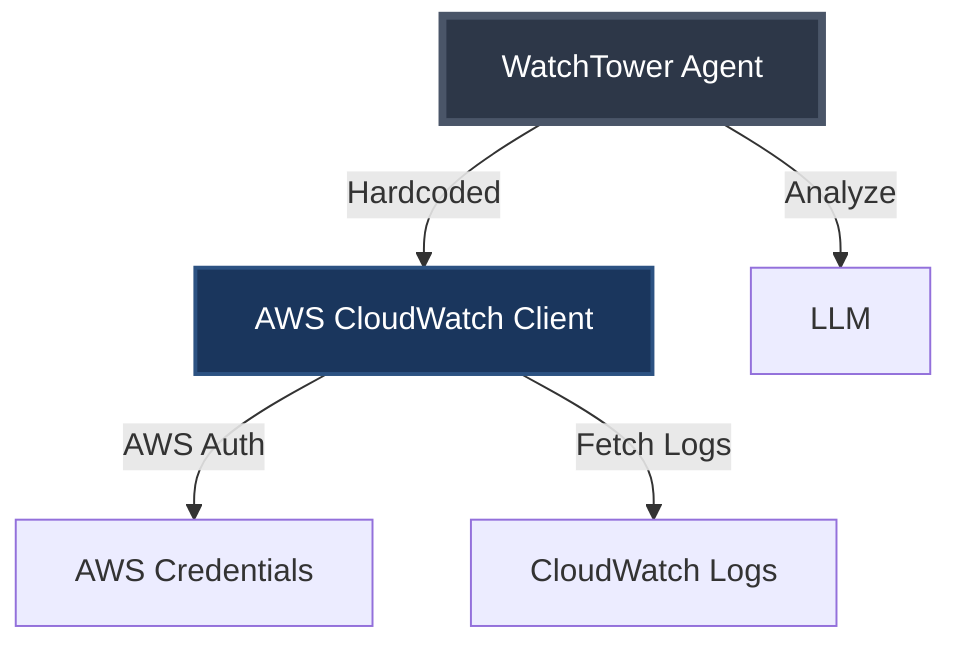
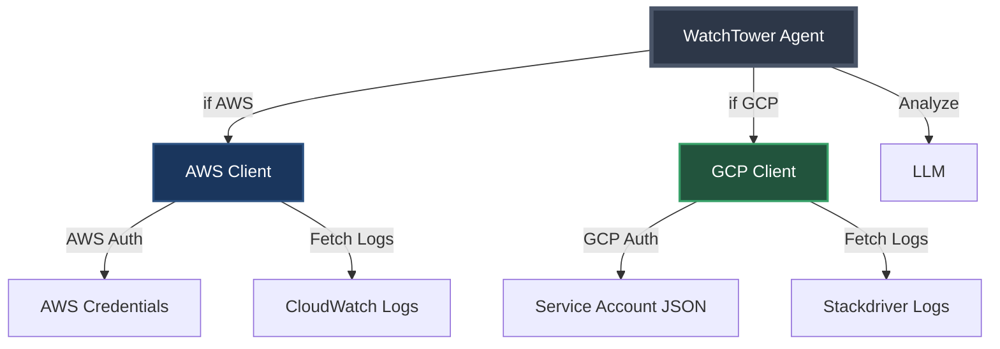

Current directory: /Users/abhishek/workspace/projects/mcp-first-principles
Current git state: branch 01-aws-mvp with AWS-only implementation

Create git branch 02-gcp-pressure that adds GCP support, showing the copy-paste problem.

Requirements:

1. First, create and checkout the branch:
```bash
git checkout -b 02-gcp-pressure
```

2. Update pom.xml to add Lombok and ensure Guava is included:
```xml
<!-- Add to dependencies section -->
<dependency>
    <groupId>org.projectlombok</groupId>
    <artifactId>lombok</artifactId>
    <version>1.18.30</version>
    <scope>provided</scope>
</dependency>
<dependency>
    <groupId>com.google.guava</groupId>
    <artifactId>guava</artifactId>
    <version>32.1.3-jre</version>
</dependency>
```

3. Create the comprehensive markdown file docs/02-gcp-pressure.md:
```markdown
# Phase 2: Customer Pressure - Adding GCP

## The Story So Far

Our AWS-only WatchTower.AI launched last month. Customer adoption has been strong, but now we're getting urgent requests...

> **Support Ticket #1247**: "We need GCP support ASAP. Half our infrastructure runs on Google Cloud."
> 
> **Sales Team**: "We're about to lose our biggest deal - they won't sign without multi-cloud support."
> 
> **Customer Feedback**: "Love the product, but we can't adopt it for just AWS. When is GCP coming?"

---

## The Current Architecture



## The Quick Fix Approach

"How hard can it be? Just add GCP support!"



---

## The Authentication Problem

### AWS Pattern
```java
// AWS uses access keys
Map<String, String> awsCredentials = Map.of(
    "accessKeyId", System.getenv("AWS_ACCESS_KEY_ID"),
    "secretAccessKey", System.getenv("AWS_SECRET_ACCESS_KEY"),
    "region", "us-east-1"
);
```

### GCP Pattern
```java
// GCP uses service account files
String gcpServiceAccount = System.getenv("GOOGLE_APPLICATION_CREDENTIALS");
// Points to a JSON file with credentials
```

**Key Difference**: AWS uses key/secret pairs, GCP uses JSON files

---

## What We're About to Build

- Copy-paste AWS code for GCP
- Add if-else statements everywhere
- Duplicate similar logic with slight variations
- Create a maintenance nightmare

## The Code Smells

🚨 **Warning Signs**:
- Constructor getting complex
- Conditional logic spreading
- Similar but not identical code
- No clear abstraction boundary

---

## Speaker Notes

### Opening
- Start with the customer quote - make it dramatic
- Show how successful MVP leads to new requirements
- This is a VERY common scenario

### Architecture Diagrams
- First diagram: Show current simple architecture
- Second diagram: Show the "obvious" solution
- Point out how messy it's already getting

### Key Points to Emphasize
1. **Different Auth Patterns**: AWS uses key/secret, GCP uses service account JSON
2. **Similar But Different APIs**: Both fetch logs, but differently
3. **The Temptation**: "Just copy and modify" seems fastest
4. **The Future Problem**: What happens with Azure? DataDog? Splunk?

### Transition to Code
"Let's see what this 'quick fix' looks like in practice..."

---

## After Implementation

Run the test in IntelliJ to show both AWS and GCP working.

Point out:
- How much code we duplicated
- The growing constructor
- The spreading if-else logic
- Ask: "What happens when we add Azure?"
```

4. Create GCPLoggingFake.java in src/main/java/com/watchtower/fakes/:
```java
package com.watchtower.fakes;

import com.watchtower.model.LogEntry;
import com.fasterxml.jackson.databind.ObjectMapper;
import com.fasterxml.jackson.databind.JsonNode;
import lombok.extern.slf4j.Slf4j;
import java.io.IOException;
import java.io.InputStream;
import java.nio.file.Files;
import java.nio.file.Paths;
import java.time.Instant;
import java.util.List;
import java.util.stream.StreamSupport;
import com.google.common.collect.ImmutableList;

/**
 * Fake GCP Logging client that reads from test resources
 * Simulates the Google Cloud Logging API
 * 
 * Notice how different this is from AWS:
 * - Different auth (service account JSON)
 * - Different API structure
 * - Different log format
 */
@Slf4j
public class GCPLoggingFake {
    private final List<LogEntry> allLogs;
    private final ObjectMapper mapper = new ObjectMapper();
    private final String projectId;
    
    public GCPLoggingFake(String serviceAccountPath) {
        // Simulate GCP authentication
        System.out.println(">>> GCP service account validated: " + serviceAccountPath);
        this.projectId = "my-gcp-project";
        
        // Load fake log data
        this.allLogs = loadLogsFromResource();
        System.out.println(">>> GCP Logging Fake initialized with " + allLogs.size() + " log entries");
        System.out.println(">>> Connected to project: " + projectId);
    }
    
    /**
     * Simulates the GCP entries.list API call
     * Notice the different parameter names and patterns vs AWS
     */
    public List<LogEntry> listLogEntries(String logName, String filter, int pageSize) {
        log.info(">>> GCP API: entries.list(logName={}, filter={}, pageSize={})", 
            logName, filter, pageSize);
        
        return allLogs.stream()
            .filter(log -> matchesLogName(log, logName))
            .filter(log -> matchesFilter(log, filter))
            .limit(pageSize)
            .collect(ImmutableList.toImmutableList());
    }
    
    private boolean matchesLogName(LogEntry log, String logName) {
        // GCP uses different naming: projects/PROJECT/logs/LOG_ID
        return log.source().contains(logName.replace("projects/" + projectId + "/logs/", ""));
    }
    
    private boolean matchesFilter(LogEntry log, String filter) {
        if (filter == null || filter.isEmpty()) {
            return true;
        }
        // GCP uses different filter syntax
        if (filter.contains("severity")) {
            String severity = filter.split("=")[1].trim().replace("\"", "");
            return log.severity().equalsIgnoreCase(severity);
        }
        return log.message().contains(filter);
    }
    
    private List<LogEntry> loadLogsFromResource() {
        try (InputStream is = getClass().getResourceAsStream("/gcp/stackdriver-logs.json")) {
            JsonNode root = mapper.readTree(is);
            JsonNode entries = root.get("entries");
            
            return StreamSupport.stream(entries.spliterator(), false)
                .map(entry -> {
                    String timestamp = entry.get("timestamp").asText();
                    String message = entry.get("textPayload").asText();
                    String severity = entry.get("severity").asText();
                    String logName = entry.get("logName").asText();
                    
                    return new LogEntry(
                        timestamp,
                        message,
                        severity,
                        logName
                    );
                })
                .collect(ImmutableList.toImmutableList());
        } catch (IOException e) {
            throw new RuntimeException("Failed to load GCP logs from resource", e);
        }
    }
}
```

5. Update WatchTowerAgent.java to add GCP support (the messy way):
```java
package com.watchtower;

import com.watchtower.fakes.AWSCloudWatchFake;
import com.watchtower.fakes.GCPLoggingFake;
import com.watchtower.llm.LLMFake;
import com.watchtower.model.LogEntry;
import lombok.extern.slf4j.Slf4j;
import java.util.List;
import java.util.Map;
import java.util.stream.Collectors;

/**
 * WatchTower.AI Agent - Now with AWS AND GCP support!
 * 
 * Notice how quickly this is getting messy:
 * - Two different clients
 * - Two different auth patterns
 * - If-else logic everywhere
 * - What happens when we add Azure?
 */
@Slf4j
public class WatchTowerAgent {
    // Now we have TWO clients!
    private final AWSCloudWatchFake awsClient;
    private final GCPLoggingFake gcpClient;
    private final LLMFake llm;
    
    public WatchTowerAgent() {
        // This constructor is getting out of hand...
        
        // AWS Authentication
        Map<String, String> awsCredentials = Map.of(
            "accessKeyId", System.getenv("AWS_ACCESS_KEY_ID"),
            "secretAccessKey", System.getenv("AWS_SECRET_ACCESS_KEY"),
            "region", "us-east-1"
        );
        
        System.out.println(">>> Authenticating with AWS...");
        this.awsClient = new AWSCloudWatchFake(awsCredentials);
        
        // GCP Authentication - completely different pattern!
        String gcpServiceAccount = System.getenv("GOOGLE_APPLICATION_CREDENTIALS");
        
        System.out.println(">>> Authenticating with GCP...");
        this.gcpClient = new GCPLoggingFake(gcpServiceAccount);
        
        // Initialize LLM
        this.llm = new LLMFake();
        
        log.info(">>> WatchTower.AI initialized with AWS and GCP support");
    }
    
    // Now we need a provider parameter! 🚨
    public String troubleshootErrors(String userQuery, String cloudProvider) {
        log.info(">>> Troubleshooting on {}: {}", cloudProvider, userQuery);
        
        List<LogEntry> logs;
        
        // The if-else mess begins... 🚨
        if ("AWS".equals(cloudProvider)) {
            // AWS-specific API call
            logs = awsClient.filterLogEvents(
                "/aws/payment-service",
                "ERROR",
                1000
            );
        } else if ("GCP".equals(cloudProvider)) {
            // GCP-specific API call - different method name, different parameters!
            logs = gcpClient.listLogEntries(
                "projects/my-gcp-project/logs/payment-service",
                "severity=\"ERROR\"",
                1000
            );
        } else {
            throw new IllegalArgumentException("Unsupported cloud provider: " + cloudProvider);
        }
        
        // At least this part is the same...
        String logData = logs.stream()
            .map(log -> String.format("[%s] %s", log.timestamp(), log.message()))
            .collect(Collectors.joining("\n"));
        
        // But wait, we should tell the LLM which cloud it's analyzing!
        return llm.complete("troubleshoot", 
            String.format("[%s] %s", cloudProvider, userQuery), 
            logData);
    }
    
    // TODO: Still need to add summary and anomaly detection...
    // TODO: What about Azure? This is already getting messy!
    // TODO: How do we handle different log formats per cloud?
    // TODO: The constructor is becoming a monster...
}
```

6. Update WatchTowerAgentTest.java to test both providers:
```java
package com.watchtower;

import org.junit.jupiter.api.BeforeEach;
import org.junit.jupiter.api.Test;
import org.junit.jupiter.api.DisplayName;
import static org.assertj.core.api.Assertions.assertThat;

/**
 * Tests for WatchTower.AI Agent
 * Branch 02-gcp-pressure: Testing AWS and GCP implementations
 */
class WatchTowerAgentTest {
    
    protected WatchTowerAgent agent;
    
    @BeforeEach
    void setup() {
        // Set up fake credentials for testing
        System.setProperty("AWS_ACCESS_KEY_ID", "fake-aws-key");
        System.setProperty("AWS_SECRET_ACCESS_KEY", "fake-aws-secret");
        System.setProperty("GOOGLE_APPLICATION_CREDENTIALS", "/path/to/fake-key.json");
        
        agent = new WatchTowerAgent();
    }
    
    @Test
    @DisplayName("Troubleshoot AWS: Why are payment APIs failing?")
    void troubleshootPaymentFailuresAWS() {
        String analysis = agent.troubleshootErrors(
            "Payment API returning 500 errors in last hour",
            "AWS"  // Now we need to specify the provider!
        );
        
        System.out.println("\n" + "=".repeat(50));
        System.out.println(">>> AWS TROUBLESHOOTING ANALYSIS");
        System.out.println("=".repeat(50));
        System.out.println(analysis);
        System.out.println("=".repeat(50) + "\n");
        
        assertThat(analysis)
            .contains("AWS")  // Should indicate which cloud
            .contains("timeout")
            .contains("connection pool")
            .contains("Recommendation");
    }
    
    @Test
    @DisplayName("Troubleshoot GCP: Why are payment APIs failing?")
    void troubleshootPaymentFailuresGCP() {
        String analysis = agent.troubleshootErrors(
            "Payment API returning 500 errors in last hour",
            "GCP"  // Same query, different cloud!
        );
        
        System.out.println("\n" + "=".repeat(50));
        System.out.println(">>> GCP TROUBLESHOOTING ANALYSIS");
        System.out.println("=".repeat(50));
        System.out.println(analysis);
        System.out.println("=".repeat(50) + "\n");
        
        assertThat(analysis)
            .contains("GCP")  // Should indicate which cloud
            .contains("timeout")
            .contains("connection pool")
            .contains("Recommendation");
    }
}
```

7. Add GCP test data to src/test/resources/gcp/stackdriver-logs.json:
```json
{
  "entries": [
    {
      "timestamp": "2024-01-20T10:00:00Z",
      "severity": "ERROR",
      "textPayload": "PaymentService: Request timeout after 30s - transaction_id: gcp-tx-789",
      "logName": "projects/my-gcp-project/logs/payment-service"
    },
    {
      "timestamp": "2024-01-20T10:01:00Z",
      "severity": "ERROR",
      "textPayload": "PaymentService: Cloud SQL connection pool exhausted (100/100 connections)",
      "logName": "projects/my-gcp-project/logs/payment-service"
    },
    {
      "timestamp": "2024-01-20T10:02:00Z",
      "severity": "WARNING",
      "textPayload": "PaymentService: High latency detected - p99: 5.2s, p95: 3.1s",
      "logName": "projects/my-gcp-project/logs/payment-service"
    },
    {
      "timestamp": "2024-01-20T10:03:00Z",
      "severity": "INFO",
      "textPayload": "UserService: Processed 1847 requests successfully",
      "logName": "projects/my-gcp-project/logs/user-service"
    },
    {
      "timestamp": "2024-01-20T10:04:00Z",
      "severity": "ERROR",
      "textPayload": "PaymentService: Circuit breaker OPEN for payment-gateway-v2",
      "logName": "projects/my-gcp-project/logs/payment-service"
    }
  ]
}
```

IMPORTANT:
- Show how the constructor is getting messy with two auth patterns
- Highlight the if-else logic spreading through the code
- Point out the duplication between AWS and GCP handling
- The test now needs to specify which cloud provider to use
- Everything still compiles and works, but at what cost?

After creating these files:
1. Run `./validate.sh` to ensure everything works
2. Open `docs/02-gcp-pressure.md` in IntelliJ markdown preview
3. Run the tests in IntelliJ to show both clouds working
4. Commit: `git add . && git commit -m "GCP Support: Copy-paste implementation showing the mess"`