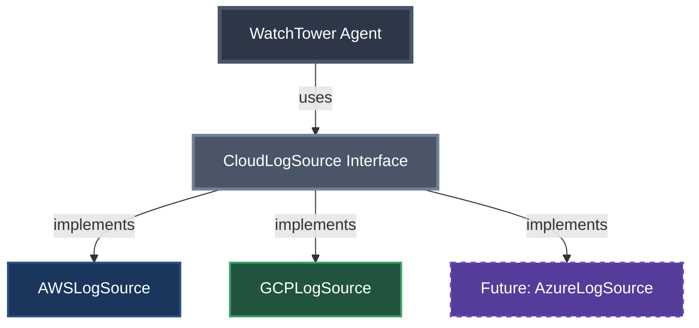

Current directory: /Users/abhishek/workspace/projects/mcp-first-principles
Current git state: branch 02-gcp-pressure with messy if-else implementation

Create git branch 03-extract-interface that refactors to a clean interface pattern.

Requirements:

1. First, create and checkout the branch:
```bash
git checkout -b 03-extract-interface
```

2. Create the comprehensive markdown file docs/03-extract-interface.md:
```markdown
# Phase 3: First Refactor - Extract Interface

## The Pain We're Feeling

Looking at our code after adding GCP support:
- Constructor is getting complex
- If-else statements everywhere  
- Similar but not identical code
- What happens when we add Azure? Or DataDog?

---

## The Solution: Extract Common Interface



## The Interface Design

```java
public interface CloudLogSource {
    // Common initialization pattern
    void initialize(Map<String, String> config);
    
    // Common log fetching pattern
    List<LogEntry> fetchLogs(String resource, String filter, int limit);
    
    // Identify the source
    String getCloudProvider();
}
```

---

## Benefits of This Approach

### Before: Provider-Specific Knowledge Everywhere
```java
// Agent needs to know AWS uses "/aws/payment-service"
// Agent needs to know GCP uses "projects/PROJECT/logs/payment-service"
switch (provider) {
    case "AWS" -> source.fetchLogs("/aws/payment-service", "ERROR", 1000);
    case "GCP" -> source.fetchLogs("projects/my-gcp-project/logs/payment-service", "ERROR", 1000);
}
```

### After: Clean Abstraction
```java
// Agent uses logical names, sources handle translation
source.fetchLogs("payment-service", "ERROR", 1000);
```

The sources internally translate:
- AWS: "payment-service" → "/aws/payment-service"
- GCP: "payment-service" → "projects/my-gcp-project/logs/payment-service"

---

## Implementation Strategy

1. **Define the interface** - What's common across all clouds?
2. **Adapt existing code** - Wrap AWS and GCP clients
3. **Refactor the agent** - Use Map<String, CloudLogSource>
4. **Simplify the flow** - No more if-else chains

---

## Speaker Notes

### Opening
- Start by showing the pain in the current code
- Highlight the constructor mess and if-else chains
- Ask: "What's the pattern here?"

### Interface Introduction
- This is classic OOP - extract what varies
- Show how all clouds do similar things differently
- The interface captures the "what", not the "how"

### Key Teaching Points
1. **Abstraction**: Hide cloud-specific details
2. **Polymorphism**: Same interface, different implementations
3. **Open/Closed**: Open for extension (new clouds), closed for modification
4. **Dependency Inversion**: Depend on abstractions, not concrete implementations

### Code Walkthrough
1. Start with the interface definition
2. Show how AWS adapter implements it
3. Show how GCP adapter implements it
4. Refactor WatchTowerAgent to use the interface
5. Run tests - everything still works!

### Transition
"This is better, but notice we still don't have a way for the agent to discover what each source can do..."

---

## The Hidden Problem

While our code is cleaner, we still have limitations:
- Sources have hardcoded mappings for known services
- What if we need logs from a service not in the mapping?
- What if different sources support different operations?
- How does the agent know what's available?

This leads us to our next challenge: **Discovery**
```

3. Create CloudLogSource.java interface in src/main/java/com/watchtower/sources/:
```java
package com.watchtower.sources;

import com.watchtower.model.LogEntry;
import java.util.List;
import java.util.Map;

/**
 * Common interface for all cloud log sources.
 * This abstraction hides cloud-specific implementation details.
 */
public interface CloudLogSource {
    
    /**
     * Initialize the source with cloud-specific configuration
     * @param config Cloud-specific config (credentials, region, project, etc.)
     */
    void initialize(Map<String, String> config);
    
    /**
     * Fetch logs from this cloud source
     * @param logicalResource The logical resource name (e.g., "payment-service")
     * @param filter The filter to apply (e.g., "ERROR", "WARN")
     * @param limit Maximum number of logs to return
     * @return List of log entries
     */
    List<LogEntry> fetchLogs(String logicalResource, String filter, int limit);
    
    /**
     * Get the cloud provider name
     * @return Provider name (AWS, GCP, AZURE, etc.)
     */
    String getCloudProvider();
}
```

4. Create AWSLogSource.java adapter in src/main/java/com/watchtower/sources/:
```java
package com.watchtower.sources;

import com.watchtower.fakes.AWSCloudWatchFake;
import com.watchtower.model.LogEntry;
import lombok.RequiredArgsConstructor;
import java.util.List;
import java.util.Map;

/**
 * AWS CloudWatch adapter implementing our common interface
 */
@RequiredArgsConstructor
public class AWSLogSource implements CloudLogSource {
    private AWSCloudWatchFake client;
    
    @Override
    public void initialize(Map<String, String> config) {
        System.out.println(">>> Initializing AWS Log Source...");
        
        // AWS-specific credential setup
        Map<String, String> awsCredentials = Map.of(
            "accessKeyId", config.getOrDefault("AWS_ACCESS_KEY_ID", ""),
            "secretAccessKey", config.getOrDefault("AWS_SECRET_ACCESS_KEY", ""),
            "region", config.getOrDefault("AWS_REGION", "us-east-1")
        );
        
        this.client = new AWSCloudWatchFake(awsCredentials);
    }
    
    @Override
    public List<LogEntry> fetchLogs(String logicalResource, String filter, int limit) {
        // Translate logical resource to AWS-specific format
        String awsLogGroup = translateToAWSLogGroup(logicalResource);
        
        // Adapt our interface to AWS-specific API
        return client.filterLogEvents(awsLogGroup, filter, limit);
    }
    
    private String translateToAWSLogGroup(String logicalResource) {
        // Map logical names to AWS log groups
        return switch (logicalResource) {
            case "payment-service" -> "/aws/payment-service";
            case "user-service" -> "/aws/user-service";
            case "order-service" -> "/aws/order-service";
            default -> "/aws/" + logicalResource; // Fallback pattern
        };
    }
    
    @Override
    public String getCloudProvider() {
        return "AWS";
    }
}
```

5. Create GCPLogSource.java adapter in src/main/java/com/watchtower/sources/:
```java
package com.watchtower.sources;

import com.watchtower.fakes.GCPLoggingFake;
import com.watchtower.model.LogEntry;
import lombok.RequiredArgsConstructor;
import java.util.List;
import java.util.Map;

/**
 * GCP Logging adapter implementing our common interface
 */
@RequiredArgsConstructor
public class GCPLogSource implements CloudLogSource {
    private GCPLoggingFake client;
    
    @Override
    public void initialize(Map<String, String> config) {
        System.out.println(">>> Initializing GCP Log Source...");
        
        // GCP-specific credential setup
        String serviceAccountPath = config.getOrDefault("GOOGLE_APPLICATION_CREDENTIALS", "");
        
        this.client = new GCPLoggingFake(serviceAccountPath);
    }
    
    @Override
    public List<LogEntry> fetchLogs(String logicalResource, String filter, int limit) {
        // Translate logical resource to GCP-specific format
        String gcpLogName = translateToGCPLogName(logicalResource);
        
        // Adapt filter format for GCP
        String gcpFilter = translateFilter(filter);
        
        // Adapt our interface to GCP-specific API
        return client.listLogEntries(gcpLogName, gcpFilter, limit);
    }
    
    private String translateToGCPLogName(String logicalResource) {
        // Map logical names to GCP log names
        String projectId = "my-gcp-project"; // Would come from config
        return switch (logicalResource) {
            case "payment-service" -> "projects/" + projectId + "/logs/payment-service";
            case "user-service" -> "projects/" + projectId + "/logs/user-service";
            case "order-service" -> "projects/" + projectId + "/logs/order-service";
            default -> "projects/" + projectId + "/logs/" + logicalResource;
        };
    }
    
    private String translateFilter(String filter) {
        // GCP uses different filter syntax
        return switch (filter) {
            case "ERROR" -> "severity=\"ERROR\"";
            case "WARN" -> "severity=\"WARNING\"";
            case "INFO" -> "severity=\"INFO\"";
            default -> filter; // Pass through unknown filters
        };
    }
    
    @Override
    public String getCloudProvider() {
        return "GCP";
    }
}
```

6. Refactor WatchTowerAgent.java to use the interface:
```java
package com.watchtower;

import com.watchtower.sources.CloudLogSource;
import com.watchtower.sources.AWSLogSource;
import com.watchtower.sources.GCPLogSource;
import com.watchtower.llm.LLMFake;
import com.watchtower.model.LogEntry;
import lombok.extern.slf4j.Slf4j;
import java.util.List;
import java.util.Map;
import java.util.stream.Collectors;

/**
 * WatchTower.AI Agent - Now with clean interface pattern!
 * 
 * Notice how much cleaner this is:
 * - No more if-else chains
 * - Easy to add new cloud providers
 * - Constructor is manageable again
 */
@Slf4j
public class WatchTowerAgent {
    private final Map<String, CloudLogSource> sources;
    private final LLMFake llm;
    
    public WatchTowerAgent() {
        // Initialize all cloud sources
        this.sources = initializeCloudSources();
        this.llm = new LLMFake();
        
        System.out.println(">>> WatchTower.AI initialized with cloud providers: " + 
            sources.keySet());
    }
    
    private Map<String, CloudLogSource> initializeCloudSources() {
        // AWS Source
        CloudLogSource awsSource = new AWSLogSource();
        awsSource.initialize(Map.of(
            "AWS_ACCESS_KEY_ID", System.getenv("AWS_ACCESS_KEY_ID"),
            "AWS_SECRET_ACCESS_KEY", System.getenv("AWS_SECRET_ACCESS_KEY"),
            "AWS_REGION", "us-east-1"
        ));
        
        // GCP Source
        CloudLogSource gcpSource = new GCPLogSource();
        gcpSource.initialize(Map.of(
            "GOOGLE_APPLICATION_CREDENTIALS", System.getenv("GOOGLE_APPLICATION_CREDENTIALS")
        ));
        
        // Return immutable map of sources
        return Map.of(
            "AWS", awsSource,
            "GCP", gcpSource
        );
    }
    
    public String troubleshootErrors(String userQuery, String cloudProvider) {
        log.info(">>> Troubleshooting on {}: {}", cloudProvider, userQuery);
        
        // Clean: No more if-else or switch statements!
        CloudLogSource source = sources.get(cloudProvider);
        if (source == null) {
            throw new IllegalArgumentException("Unsupported cloud provider: " + cloudProvider);
        }
        
        // Use logical resource name - no cloud-specific knowledge here!
        List<LogEntry> logs = source.fetchLogs("payment-service", "ERROR", 1000);
        
        // Convert to string for LLM
        String logData = logs.stream()
            .map(log -> String.format("[%s] %s", log.timestamp(), log.message()))
            .collect(Collectors.joining("\n"));
        
        return llm.complete("troubleshoot", 
            String.format("[%s] %s", cloudProvider, userQuery), 
            logData);
    }
    
    // Clean method to check available providers
    public List<String> getAvailableProviders() {
        return List.copyOf(sources.keySet());
    }
}
```

7. Update WatchTowerAgentTest.java to show the cleaner approach:
```java
package com.watchtower;

import org.junit.jupiter.api.BeforeEach;
import org.junit.jupiter.api.Test;
import org.junit.jupiter.api.DisplayName;
import static org.assertj.core.api.Assertions.assertThat;

/**
 * Tests for WatchTower.AI Agent
 * Branch 03-extract-interface: Testing the cleaner interface-based approach
 */
class WatchTowerAgentTest {
    
    protected WatchTowerAgent agent;
    
    @BeforeEach
    void setup() {
        // Set up fake credentials for testing
        System.setProperty("AWS_ACCESS_KEY_ID", "fake-aws-key");
        System.setProperty("AWS_SECRET_ACCESS_KEY", "fake-aws-secret");
        System.setProperty("GOOGLE_APPLICATION_CREDENTIALS", "/path/to/fake-key.json");
        
        agent = new WatchTowerAgent();
    }
    
    @Test
    @DisplayName("Show available cloud providers")
    void showAvailableProviders() {
        var providers = agent.getAvailableProviders();
        
        System.out.println("\n" + "=".repeat(50));
        System.out.println(">>> AVAILABLE CLOUD PROVIDERS");
        System.out.println("=".repeat(50));
        providers.forEach(p -> System.out.println("  - " + p));
        System.out.println("=".repeat(50) + "\n");
        
        assertThat(providers).containsExactlyInAnyOrder("AWS", "GCP");
    }
    
    @Test
    @DisplayName("Troubleshoot AWS: Why are payment APIs failing?")
    void troubleshootPaymentFailuresAWS() {
        String analysis = agent.troubleshootErrors(
            "Payment API returning 500 errors in last hour",
            "AWS"
        );
        
        System.out.println("\n" + "=".repeat(50));
        System.out.println(">>> AWS TROUBLESHOOTING ANALYSIS");
        System.out.println("=".repeat(50));
        System.out.println(analysis);
        System.out.println("=".repeat(50) + "\n");
        
        assertThat(analysis)
            .contains("AWS")
            .contains("timeout")
            .contains("connection pool");
    }
    
    @Test
    @DisplayName("Troubleshoot GCP: Why are payment APIs failing?")
    void troubleshootPaymentFailuresGCP() {
        String analysis = agent.troubleshootErrors(
            "Payment API returning 500 errors in last hour",
            "GCP"
        );
        
        System.out.println("\n" + "=".repeat(50));
        System.out.println(">>> GCP TROUBLESHOOTING ANALYSIS");
        System.out.println("=".repeat(50));
        System.out.println(analysis);
        System.out.println("=".repeat(50) + "\n");
        
        assertThat(analysis)
            .contains("GCP")
            .contains("timeout")
            .contains("connection pool");
    }
}
```

IMPORTANT:
- Show how the interface abstracts cloud-specific details
- Highlight the removal of if-else chains
- Point out how easy it would be to add Azure now
- Note that we still have some provider-specific knowledge (resource paths)
- Everything still works but the code is much cleaner

After creating these files:
1. Run `./validate.sh` to ensure everything works
2. Open `docs/03-extract-interface.md` in IntelliJ markdown preview
3. Run the tests in IntelliJ to show the cleaner implementation
4. Commit: `git add . && git commit -m "Extract Interface: Clean abstraction for cloud sources"`