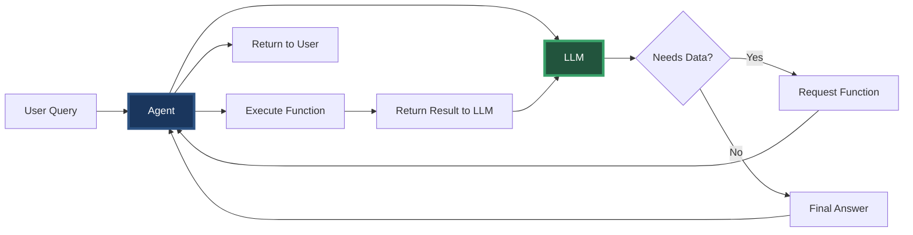

Current directory: /Users/abhishek/workspace/projects/mcp-first-principles
Current git state: branch 03-extract-interface with CloudLogSource interface and two methods (fetchLogs, fetchMetrics)

Create git branch 04-function-calling that shows the function calling revolution and agent-LLM loop.

Requirements:

1. First, create and checkout the branch:
```bash
git checkout -b 04-function-calling
```

2. Create the comprehensive markdown file docs/04-function-calling.md:
```markdown
# Phase 4: Function Calling Revolution

## The Game Changer

June 2023: OpenAI announces function calling. Everything changes.

> "What if instead of the agent deciding what to fetch, the LLM could request exactly what it needs?"

---

## From Imperative to Declarative

### Before: We Orchestrate Everything
```java
// We decide the sequence
List<LogEntry> logs = source.fetchLogs(...);
List<Metric> metrics = source.fetchMetrics(...);
String context = combine(logs, metrics);
llm.complete(context);
```

### After: LLM Orchestrates
```java
// We describe what's available
List<Function> functions = describeFunctions();

// LLM decides what to call
while (llm.needsMoreData()) {
    FunctionCall call = llm.requestFunction();
    Object result = executeFunction(call);
    llm.processResult(result);
}
```

---

## The Agent-LLM Loop



---

## Function Definitions

```java
// We describe available functions
List<FunctionDefinition> functions = List.of(
    new FunctionDefinition(
        "fetchLogs",
        "Fetch logs from cloud source",
        List.of(
            new Parameter("resource", "string", "Service name"),
            new Parameter("filter", "string", "Log level: ERROR, WARN, INFO"),
            new Parameter("limit", "integer", "Maximum logs to return")
        )
    ),
    new FunctionDefinition(
        "fetchMetrics",
        "Fetch metrics from cloud source",
        List.of(
            new Parameter("resource", "string", "Service name"),
            new Parameter("metricName", "string", "Metric: error_rate, cpu_usage"),
            new Parameter("timeRange", "string", "Range: 1h, 24h, 7d")
        )
    )
);
```

---

## Real Example: Dynamic Investigation

**User**: "Why are payments slow?"

**LLM**: "I'll investigate the payment performance. Let me start by checking recent logs."
- Calls: `fetchLogs("payment-service", "WARN", 1000)`

**LLM**: "I see latency warnings. Let me check the error rate."
- Calls: `fetchMetrics("payment-service", "error_rate", "1h")`

**LLM**: "Error rate is normal. Let me check CPU usage."
- Calls: `fetchMetrics("payment-service", "cpu_usage", "1h")`

**LLM**: "High CPU detected. Let me check database logs."
- Calls: `fetchLogs("database-service", "WARN", 500)`

**LLM**: "Found the issue: Database connection pool exhaustion is causing payment service CPU spikes due to retry storms."

---

## Speaker Notes

### Opening (1 min)
- Set the date: "June 2023 - OpenAI changes everything"
- The key insight: "What if LLMs could call functions?"
- "Let's see this in action"

### Code Walkthrough (6 min)

#### First: FunctionDefinition.java
- Show how we describe functions
- "It's like a menu for the LLM"
- Parameters have types and descriptions

#### Second: Updated WatchTowerAgent.java
- Show the new `analyzeWithFunctions` method
- Walk through the agent-LLM loop
- "The LLM drives, we execute"

#### Third: Live Example
- Run the test showing dynamic investigation
- Point out how LLM decides the sequence
- "It's like having a smart detective"

### Key Messages
- Shift from imperative to declarative
- LLM becomes the orchestrator
- More flexible and intelligent
- Same CloudLogSource, new interaction pattern

### Transition (30 sec)
"But we have a new problem: AWS and GCP expose their functions differently..."

---

## The New Challenge

Now we need to expose our CloudLogSource functions to the LLM, but:
- AWS team wants REST API
- GCP team wants gRPC
- Each with different function formats

This leads to our next challenge: **Transport Standardization**
```

3. Create FunctionDefinition.java for describing functions:
```java
package com.watchtower.functions;

import lombok.AllArgsConstructor;
import lombok.Builder;
import lombok.Data;
import java.util.List;

/**
 * Describes a function that can be called by the LLM
 */
@Data
@Builder
@AllArgsConstructor
public class FunctionDefinition {
    private String name;
    private String description;
    private List<Parameter> parameters;
    
    @Data
    @AllArgsConstructor
    public static class Parameter {
        private String name;
        private String type;  // "string", "integer", "boolean"
        private String description;
        private boolean required;
        
        public Parameter(String name, String type, String description) {
            this(name, type, description, true);
        }
    }
}
```

4. Create FunctionCall.java for LLM function requests:
```java
package com.watchtower.functions;

import lombok.AllArgsConstructor;
import lombok.Data;
import java.util.Map;

/**
 * Represents a function call request from the LLM
 */
@Data
@AllArgsConstructor
public class FunctionCall {
    private String name;
    private Map<String, Object> arguments;
}
```

5. Create FunctionResult.java for function execution results:
```java
package com.watchtower.functions;

import lombok.AllArgsConstructor;
import lombok.Data;

/**
 * Result of executing a function
 */
@Data
@AllArgsConstructor
public class FunctionResult {
    private String functionName;
    private Object result;
    private boolean success;
    private String error;
    
    public static FunctionResult success(String functionName, Object result) {
        return new FunctionResult(functionName, result, true, null);
    }
    
    public static FunctionResult error(String functionName, String error) {
        return new FunctionResult(functionName, null, false, error);
    }
}
```

6. Update LLMFake.java to support function calling:
```java
package com.watchtower.llm;

import com.watchtower.functions.*;
import java.io.IOException;
import java.io.InputStream;
import java.nio.charset.StandardCharsets;
import java.util.*;

/**
 * Enhanced LLM fake that supports function calling
 */
public class LLMFake {
    
    // Simulated conversation state
    private List<Map<String, Object>> conversation = new ArrayList<>();
    private int functionCallCount = 0;
    
    /**
     * Complete with function calling support
     */
    public LLMResponse completeWithFunctions(
            List<Map<String, Object>> messages,
            List<FunctionDefinition> availableFunctions) {
        
        // Add messages to conversation
        conversation.addAll(messages);
        
        // Simulate LLM decision making based on conversation
        return simulateLLMResponse(availableFunctions);
    }
    
    private LLMResponse simulateLLMResponse(List<FunctionDefinition> functions) {
        // For demo: simulate intelligent function calling based on conversation
        functionCallCount++;
        
        // First call: always fetch error logs
        if (functionCallCount == 1) {
            return LLMResponse.functionCall(
                "I'll investigate the issue. Let me start by checking error logs.",
                new FunctionCall("fetchLogs", Map.of(
                    "resource", "payment-service",
                    "filter", "ERROR",
                    "limit", 1000
                ))
            );
        }
        
        // Second call: check metrics
        if (functionCallCount == 2) {
            return LLMResponse.functionCall(
                "I see errors in the logs. Let me check the error rate metrics.",
                new FunctionCall("fetchMetrics", Map.of(
                    "resource", "payment-service",
                    "metricName", "error_rate",
                    "timeRange", "1h"
                ))
            );
        }
        
        // Third call: check CPU
        if (functionCallCount == 3) {
            return LLMResponse.functionCall(
                "Error rate is elevated. Let me check CPU usage.",
                new FunctionCall("fetchMetrics", Map.of(
                    "resource", "payment-service",
                    "metricName", "cpu_usage",
                    "timeRange", "1h"
                ))
            );
        }
        
        // Fourth call: check database
        if (functionCallCount == 4) {
            return LLMResponse.functionCall(
                "High CPU detected. Let me check the database service.",
                new FunctionCall("fetchLogs", Map.of(
                    "resource", "database-service",
                    "filter", "WARN",
                    "limit", 500
                ))
            );
        }
        
        // Final response
        return LLMResponse.finalAnswer(
            "Based on my investigation:\n\n" +
            "**Root Cause**: Database connection pool exhaustion is causing payment service issues.\n\n" +
            "**Evidence**:\n" +
            "1. Payment service showing timeout errors\n" +
            "2. Error rate increased to 15% in the last hour\n" +
            "3. CPU usage at 85% due to retry attempts\n" +
            "4. Database logs show connection pool exhaustion\n\n" +
            "**Recommendation**: Increase database connection pool size and implement circuit breaker."
        );
    }
    
    // Backward compatibility
    public String complete(String promptType, String userQuery, String data) {
        try {
            String resourcePath = String.format("/llm/%s-response.txt", promptType);
            InputStream is = getClass().getResourceAsStream(resourcePath);
            if (is != null) {
                return new String(is.readAllBytes(), StandardCharsets.UTF_8);
            }
        } catch (IOException e) {
            // Ignore
        }
        return "Analysis of " + userQuery + " based on provided data.";
    }
    
    public void reset() {
        conversation.clear();
        functionCallCount = 0;
    }
}
```

7. Create LLMResponse.java:
```java
package com.watchtower.llm;

import com.watchtower.functions.FunctionCall;
import lombok.AllArgsConstructor;
import lombok.Data;

/**
 * Response from LLM that may include function calls
 */
@Data
@AllArgsConstructor
public class LLMResponse {
    private String content;
    private FunctionCall functionCall;
    private boolean needsMoreData;
    
    public static LLMResponse functionCall(String reasoning, FunctionCall call) {
        return new LLMResponse(reasoning, call, true);
    }
    
    public static LLMResponse finalAnswer(String answer) {
        return new LLMResponse(answer, null, false);
    }
}
```

8. Update WatchTowerAgent.java with function calling:
```java
package com.watchtower;

import com.watchtower.sources.*;
import com.watchtower.functions.*;
import com.watchtower.llm.*;
import com.watchtower.model.*;
import lombok.extern.slf4j.Slf4j;
import java.util.*;
import java.util.stream.Collectors;

/**
 * WatchTower.AI Agent - Now with Function Calling!
 * 
 * The LLM can now orchestrate data fetching instead of us hardcoding it.
 */
@Slf4j
public class WatchTowerAgent {
    private final Map<String, CloudLogSource> sources;
    private final LLMFake llm;
    
    // Define available functions
    private final List<FunctionDefinition> availableFunctions = List.of(
        FunctionDefinition.builder()
            .name("fetchLogs")
            .description("Fetch logs from cloud source")
            .parameters(List.of(
                new FunctionDefinition.Parameter("resource", "string", "Service name (e.g., payment-service)"),
                new FunctionDefinition.Parameter("filter", "string", "Log level: ERROR, WARN, INFO"),
                new FunctionDefinition.Parameter("limit", "integer", "Maximum number of logs")
            ))
            .build(),
            
        FunctionDefinition.builder()
            .name("fetchMetrics")
            .description("Fetch metrics from cloud source")
            .parameters(List.of(
                new FunctionDefinition.Parameter("resource", "string", "Service name"),
                new FunctionDefinition.Parameter("metricName", "string", "Metric name: error_rate, cpu_usage, request_count"),
                new FunctionDefinition.Parameter("timeRange", "string", "Time range: 1h, 24h, 7d")
            ))
            .build()
    );
    
    public WatchTowerAgent() {
        this.sources = initializeCloudSources();
        this.llm = new LLMFake();
        
        System.out.println(">>> WatchTower.AI initialized with function calling");
        System.out.println(">>> Available functions: " + 
            availableFunctions.stream().map(FunctionDefinition::getName).toList());
    }
    
    private Map<String, CloudLogSource> initializeCloudSources() {
        CloudLogSource awsSource = new AWSLogSource();
        awsSource.initialize(Map.of(
            "AWS_ACCESS_KEY_ID", System.getenv("AWS_ACCESS_KEY_ID"),
            "AWS_SECRET_ACCESS_KEY", System.getenv("AWS_SECRET_ACCESS_KEY")
        ));
        
        CloudLogSource gcpSource = new GCPLogSource();
        gcpSource.initialize(Map.of(
            "GOOGLE_APPLICATION_CREDENTIALS", System.getenv("GOOGLE_APPLICATION_CREDENTIALS")
        ));
        
        return Map.of("AWS", awsSource, "GCP", gcpSource);
    }
    
    /**
     * NEW: Analyze using function calling - LLM orchestrates!
     */
    public String analyzeWithFunctions(String userQuery, String cloudProvider) {
        System.out.println("\n>>> Starting function-based analysis");
        System.out.println(">>> User query: " + userQuery);
        
        CloudLogSource source = sources.get(cloudProvider);
        if (source == null) {
            return "Unknown cloud provider: " + cloudProvider;
        }
        
        // Initialize conversation
        List<Map<String, Object>> conversation = new ArrayList<>();
        conversation.add(Map.of(
            "role", "user",
            "content", userQuery + " (analyzing " + cloudProvider + ")"
        ));
        
        // Agent-LLM loop
        llm.reset();
        int iterations = 0;
        
        while (iterations < 10) { // Safety limit
            iterations++;
            
            // Get LLM response with function calling
            LLMResponse response = llm.completeWithFunctions(conversation, availableFunctions);
            
            System.out.println(">>> LLM: " + response.getContent());
            
            if (response.getFunctionCall() != null) {
                // LLM wants to call a function
                FunctionCall call = response.getFunctionCall();
                System.out.println(">>> Function request: " + call.getName() + 
                                 " with args: " + call.getArguments());
                
                // Execute the function
                FunctionResult result = executeFunction(call, source);
                
                // Add to conversation
                conversation.add(Map.of(
                    "role", "assistant",
                    "content", response.getContent(),
                    "function_call", call
                ));
                
                conversation.add(Map.of(
                    "role", "function",
                    "name", call.getName(),
                    "content", formatFunctionResult(result)
                ));
                
                System.out.println(">>> Function result provided to LLM");
                
            } else {
                // LLM has final answer
                System.out.println(">>> Analysis complete");
                return response.getContent();
            }
        }
        
        return "Analysis incomplete - reached iteration limit";
    }
    
    /**
     * Execute a function requested by the LLM
     */
    private FunctionResult executeFunction(FunctionCall call, CloudLogSource source) {
        try {
            return switch (call.getName()) {
                case "fetchLogs" -> {
                    String resource = (String) call.getArguments().get("resource");
                    String filter = (String) call.getArguments().get("filter");
                    Integer limit = (Integer) call.getArguments().get("limit");
                    
                    List<LogEntry> logs = source.fetchLogs(resource, filter, limit);
                    yield FunctionResult.success("fetchLogs", logs);
                }
                
                case "fetchMetrics" -> {
                    String resource = (String) call.getArguments().get("resource");
                    String metricName = (String) call.getArguments().get("metricName");
                    String timeRange = (String) call.getArguments().get("timeRange");
                    
                    List<Metric> metrics = source.fetchMetrics(resource, metricName, timeRange);
                    yield FunctionResult.success("fetchMetrics", metrics);
                }
                
                default -> FunctionResult.error(call.getName(), "Unknown function");
            };
        } catch (Exception e) {
            return FunctionResult.error(call.getName(), e.getMessage());
        }
    }
    
    private String formatFunctionResult(FunctionResult result) {
        if (!result.isSuccess()) {
            return "Error: " + result.getError();
        }
        
        if (result.getResult() instanceof List<?> list) {
            if (!list.isEmpty() && list.get(0) instanceof LogEntry) {
                List<LogEntry> logs = (List<LogEntry>) list;
                return "Found " + logs.size() + " log entries:\n" +
                    logs.stream()
                        .limit(10)
                        .map(log -> String.format("[%s] %s", log.timestamp(), log.message()))
                        .collect(Collectors.joining("\n"));
            } else if (!list.isEmpty() && list.get(0) instanceof Metric) {
                List<Metric> metrics = (List<Metric>) list;
                return "Found " + metrics.size() + " metric data points:\n" +
                    metrics.stream()
                        .limit(10)
                        .map(m -> String.format("[%s] %s: %.2f %s", 
                            m.getTimestamp(), m.getName(), m.getValue(), m.getUnit()))
                        .collect(Collectors.joining("\n"));
            }
        }
        
        return result.getResult().toString();
    }
    
    // Keep old methods for comparison
    public String troubleshootErrors(String userQuery, String cloudProvider) {
        log.info(">>> OLD METHOD: Troubleshooting with hardcoded sequence");
        
        CloudLogSource source = sources.get(cloudProvider);
        if (source == null) {
            return "Unknown provider: " + cloudProvider;
        }
        
        // WE decide to fetch logs first
        List<LogEntry> logs = source.fetchLogs("payment-service", "ERROR", 1000);
        
        // WE decide to also check metrics
        List<Metric> metrics = source.fetchMetrics("payment-service", "error_rate", "1h");
        
        // WE manually combine the data
        String logData = logs.stream()
            .map(log -> String.format("[%s] %s", log.timestamp(), log.message()))
            .collect(Collectors.joining("\n"));
            
        String metricData = metrics.stream()
            .map(m -> String.format("[%s] %s: %.2f %s", 
                m.getTimestamp(), m.getName(), m.getValue(), m.getUnit()))
            .collect(Collectors.joining("\n"));
        
        String combinedContext = String.format(
            "User Query: %s\n\nError Logs:\n%s\n\nError Rate Metrics:\n%s",
            userQuery, logData, metricData
        );
        
        return llm.complete("troubleshoot", combinedContext);
    }
    
    public Map<String, SourceCapabilities> discoverCapabilities() {
        return sources.entrySet().stream()
            .collect(Collectors.toMap(
                Map.Entry::getKey,
                e -> e.getValue().getCapabilities()
            ));
    }
}
```

9. Create FunctionCallingTest.java to demonstrate the new pattern:
```java
package com.watchtower;

import org.junit.jupiter.api.BeforeEach;
import org.junit.jupiter.api.Test;
import org.junit.jupiter.api.DisplayName;
import static org.assertj.core.api.Assertions.assertThat;

/**
 * Demonstrates the function calling revolution
 */
class FunctionCallingTest {
    
    private WatchTowerAgent agent;
    
    @BeforeEach
    void setup() {
        System.setProperty("AWS_ACCESS_KEY_ID", "fake");
        System.setProperty("AWS_SECRET_ACCESS_KEY", "fake");
        System.setProperty("GOOGLE_APPLICATION_CREDENTIALS", "fake");
        
        agent = new WatchTowerAgent();
    }
    
    @Test
    @DisplayName("Compare: Old hardcoded vs New function calling")
    void compareOldVsNew() {
        System.out.println("\n" + "=".repeat(60));
        System.out.println(">>> COMPARISON: Hardcoded vs Function Calling");
        System.out.println("=".repeat(60));
        
        // Old way
        System.out.println("\n--- OLD WAY (Hardcoded Sequence) ---");
        String oldResult = agent.troubleshootErrors("Why are payments failing?", "AWS");
        System.out.println("Old result: " + oldResult.substring(0, Math.min(100, oldResult.length())) + "...");
        
        // New way
        System.out.println("\n--- NEW WAY (LLM Orchestrates) ---");
        String newResult = agent.analyzeWithFunctions("Why are payments failing?", "AWS");
        System.out.println("\nFinal result:\n" + newResult);
        
        System.out.println("=".repeat(60));
    }
    
    @Test
    @DisplayName("Dynamic investigation with function calling")
    void dynamicInvestigation() {
        System.out.println("\n" + "=".repeat(60));
        System.out.println(">>> DYNAMIC INVESTIGATION");
        System.out.println("=".repeat(60));
        
        String result = agent.analyzeWithFunctions(
            "Payment service is slow. Investigate why.", 
            "AWS"
        );
        
        assertThat(result).contains("Root Cause");
        assertThat(result).contains("Database connection pool");
    }
    
    @Test
    @DisplayName("Different queries lead to different function sequences")
    void differentQueryPatterns() {
        System.out.println("\n" + "=".repeat(60));
        System.out.println(">>> DIFFERENT QUERIES, DIFFERENT SEQUENCES");
        System.out.println("=".repeat(60));
        
        // Query 1: Error focused
        System.out.println("\n--- Query: Error Investigation ---");
        agent.analyzeWithFunctions("Check for any errors in payment service", "GCP");
        
        // Reset LLM state
        agent = new WatchTowerAgent();
        
        // Query 2: Performance focused  
        System.out.println("\n--- Query: Performance Investigation ---");
        agent.analyzeWithFunctions("Analyze payment service performance", "GCP");
        
        System.out.println("\n>>> Notice: LLM chooses different function sequences!");
    }
}
```

10. Create transport examples showing the new problem - transports/CloudLogSourceREST.java:
```java
package com.watchtower.transports;

/**
 * AWS exposes their CloudLogSource via REST
 * 
 * Notice: They need to translate function definitions to OpenAPI format
 */
public class CloudLogSourceREST {
    // REST endpoint: POST /functions/execute
    // {
    //   "function": "fetchLogs",
    //   "arguments": {
    //     "resource": "payment-service",
    //     "filter": "ERROR",
    //     "limit": 1000
    //   }
    // }
    
    // OpenAPI spec needed for function discovery
    // Different format than our FunctionDefinition!
}
```

11. Create transports/CloudLogSourceGRPC.java:
```java
package com.watchtower.transports;

/**
 * GCP exposes their CloudLogSource via gRPC
 * 
 * Notice: They need protobuf definitions for functions
 */
public class CloudLogSourceGRPC {
    // service CloudLogSource {
    //   rpc ExecuteFunction(FunctionRequest) returns (FunctionResponse);
    // }
    //
    // message FunctionRequest {
    //   string function_name = 1;
    //   google.protobuf.Struct arguments = 2;
    // }
    
    // Different format than our FunctionDefinition!
}
```

IMPORTANT:
- Shows the shift from imperative (we orchestrate) to declarative (LLM orchestrates)
- Demonstrates the agent-LLM loop with multiple function calls
- LLM makes intelligent decisions about what data to fetch
- Sets up the transport problem for Phase 5
- Keep tests demonstrative and visual

After creating these files:
1. Run `./validate.sh` to ensure everything compiles
2. Open `docs/04-function-calling.md` in IntelliJ markdown preview
3. Walk through the function calling pattern
4. Run FunctionCallingTest to show the dynamic behavior
5. Point out the new transport problem
6. Commit: `git add . && git commit -m "Function Calling: LLM orchestrates data fetching"`
