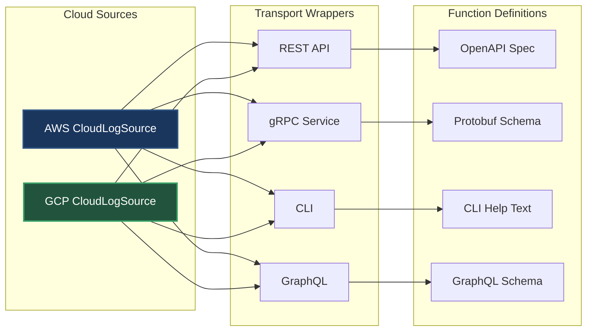

Current directory: /Users/abhishek/workspace/projects/mcp-first-principles
Current git state: branch 04-function-calling with function calling and agent-LLM loop

Create git branch 05-transport-standardization that shows the transport multiplication problem.

Requirements:

1. First, create and checkout the branch:
```bash
git checkout -b 05-transport-standardization
```

2. Create the comprehensive markdown file docs/05-transport-standardization.md:
```markdown
# Phase 5: Transport Chaos - The Server Side

## The New Problem

Function calling is great! But now we need to expose our CloudLogSources to different consumers:

> **Web Team**: "We need REST APIs for our dashboard"
> 
> **Platform Team**: "Everything must be gRPC for our microservices"
> 
> **DevOps**: "Can we get a CLI interface?"
> 
> **Mobile Team**: "What about GraphQL?"

---

## The Multiplication Returns



**The Math**: 2 sources × 4 transports = 8 implementations!

---

## Different Formats for Same Functions

### Our Function Definition
```java
new FunctionDefinition(
    "fetchLogs",
    "Fetch logs from cloud source",
    List.of(
        new Parameter("resource", "string", "Service name"),
        new Parameter("filter", "string", "Log level"),
        new Parameter("limit", "integer", "Max logs")
    )
)
```

### REST: OpenAPI Format
```yaml
/functions/fetchLogs:
  post:
    summary: Fetch logs from cloud source
    requestBody:
      content:
        application/json:
          schema:
            type: object
            properties:
              resource:
                type: string
                description: Service name
              filter:
                type: string
                description: Log level
              limit:
                type: integer
                description: Max logs
    responses:
      200:
        description: Log entries
```

### gRPC: Protobuf Format
```protobuf
service CloudLogSource {
  rpc FetchLogs(FetchLogsRequest) returns (FetchLogsResponse);
}

message FetchLogsRequest {
  string resource = 1;  // Service name
  string filter = 2;    // Log level
  int32 limit = 3;      // Max logs
}

message FetchLogsResponse {
  repeated LogEntry logs = 1;
}
```

### CLI: Argument Format
```bash
cloud-logs fetch --resource payment-service \
                 --filter ERROR \
                 --limit 1000 \
                 --help

Options:
  --resource  Service name (required)
  --filter    Log level: ERROR, WARN, INFO
  --limit     Maximum logs to return
```

---

## The Implementation Explosion

Each transport needs:
- Different authentication methods
- Different error handling
- Different discovery mechanisms
- Different testing approaches
- Different documentation

---

## Speaker Notes

### Opening (1 min)
- Show the team requests for different transports
- "Success brings new challenges"
- "Let's see what this means for our code"

### Code Walkthrough (5 min)

#### First: Show the wrapper classes
1. Open `AWSCloudLogSourceREST.java`
    - Point out the translation logic
    - "Same function, different format"

2. Open `AWSCloudLogSourceGRPC.java`
    - Show protobuf translation
    - "Completely different approach"

3. Count the files needed
    - "2 sources × 4 transports = 8 classes"
    - "Plus all the schema definitions"

#### Second: Show the function translation problem
- Our FunctionDefinition format
- OpenAPI needs different structure
- Protobuf needs .proto files
- Each has different type systems

### Key Messages
- Same functionality, multiple implementations
- Translation complexity for each transport
- Maintenance nightmare as we add sources
- Testing becomes multiplicative

### Transition (30 sec)
"What if we just picked ONE transport format?"

---

## The Path Forward

We need:
1. One transport mechanism
2. One message format
3. One discovery method
4. One error handling approach

This leads to our next insight: **Protocol Standardization**
```

3. Clean up WatchTowerAgent.java removing old methods:
```java
package com.watchtower;

import com.watchtower.sources.*;
import com.watchtower.functions.*;
import com.watchtower.llm.*;
import com.watchtower.model.*;
import lombok.extern.slf4j.Slf4j;
import java.util.*;
import java.util.stream.Collectors;

/**
 * WatchTower.AI Agent - Clean version with function calling only
 */
@Slf4j
public class WatchTowerAgent {
    private final Map sources;
    private final LLMFake llm;
    
    // Available functions that can be called
    private final List availableFunctions = List.of(
        FunctionDefinition.builder()
            .name("fetchLogs")
            .description("Fetch logs from cloud source")
            .parameters(List.of(
                new FunctionDefinition.Parameter("resource", "string", "Service name (e.g., payment-service)"),
                new FunctionDefinition.Parameter("filter", "string", "Log level: ERROR, WARN, INFO"),
                new FunctionDefinition.Parameter("limit", "integer", "Maximum number of logs")
            ))
            .build(),
            
        FunctionDefinition.builder()
            .name("fetchMetrics")
            .description("Fetch metrics from cloud source")
            .parameters(List.of(
                new FunctionDefinition.Parameter("resource", "string", "Service name"),
                new FunctionDefinition.Parameter("metricName", "string", "Metric name: error_rate, cpu_usage, request_count"),
                new FunctionDefinition.Parameter("timeRange", "string", "Time range: 1h, 24h, 7d")
            ))
            .build()
    );
    
    public WatchTowerAgent() {
        this.sources = initializeCloudSources();
        this.llm = new LLMFake();
        
        System.out.println(">>> WatchTower.AI initialized");
        System.out.println(">>> Available functions: " + 
            availableFunctions.stream().map(FunctionDefinition::getName).toList());
    }
    
    private Map initializeCloudSources() {
        CloudLogSource awsSource = new AWSLogSource();
        awsSource.initialize(Map.of(
            "AWS_ACCESS_KEY_ID", System.getenv("AWS_ACCESS_KEY_ID"),
            "AWS_SECRET_ACCESS_KEY", System.getenv("AWS_SECRET_ACCESS_KEY")
        ));
        
        CloudLogSource gcpSource = new GCPLogSource();
        gcpSource.initialize(Map.of(
            "GOOGLE_APPLICATION_CREDENTIALS", System.getenv("GOOGLE_APPLICATION_CREDENTIALS")
        ));
        
        return Map.of("AWS", awsSource, "GCP", gcpSource);
    }
    
    /**
     * Analyze using function calling - LLM orchestrates the investigation
     */
    public String analyze(String userQuery, String cloudProvider) {
        CloudLogSource source = sources.get(cloudProvider);
        if (source == null) {
            return "Unknown cloud provider: " + cloudProvider;
        }
        
        // Initialize conversation
        List> conversation = new ArrayList<>();
        conversation.add(Map.of(
            "role", "user",
            "content", userQuery + " (analyzing " + cloudProvider + ")"
        ));
        
        // Agent-LLM loop
        llm.reset();
        int iterations = 0;
        
        while (iterations < 10) { // Safety limit
            iterations++;
            
            // Get LLM response
            LLMResponse response = llm.completeWithFunctions(conversation, availableFunctions);
            
            System.out.println(">>> LLM: " + response.getContent());
            
            if (response.getFunctionCall() != null) {
                // LLM wants to call a function
                FunctionCall call = response.getFunctionCall();
                System.out.println(">>> Function request: " + call.getName() + 
                                 " with args: " + call.getArguments());
                
                // Execute the function
                FunctionResult result = executeFunction(call, source);
                
                // Add to conversation
                conversation.add(Map.of(
                    "role", "assistant",
                    "content", response.getContent(),
                    "function_call", call
                ));
                
                conversation.add(Map.of(
                    "role", "function",
                    "name", call.getName(),
                    "content", formatFunctionResult(result)
                ));
                
            } else {
                // LLM has final answer
                return response.getContent();
            }
        }
        
        return "Analysis incomplete - reached iteration limit";
    }
    
    /**
     * Execute a function requested by the LLM
     */
    private FunctionResult executeFunction(FunctionCall call, CloudLogSource source) {
        try {
            return switch (call.getName()) {
                case "fetchLogs" -> {
                    String resource = (String) call.getArguments().get("resource");
                    String filter = (String) call.getArguments().get("filter");
                    Integer limit = (Integer) call.getArguments().get("limit");
                    
                    List logs = source.fetchLogs(resource, filter, limit);
                    yield FunctionResult.success("fetchLogs", logs);
                }
                
                case "fetchMetrics" -> {
                    String resource = (String) call.getArguments().get("resource");
                    String metricName = (String) call.getArguments().get("metricName");
                    String timeRange = (String) call.getArguments().get("timeRange");
                    
                    List metrics = source.fetchMetrics(resource, metricName, timeRange);
                    yield FunctionResult.success("fetchMetrics", metrics);
                }
                
                default -> FunctionResult.error(call.getName(), "Unknown function");
            };
        } catch (Exception e) {
            return FunctionResult.error(call.getName(), e.getMessage());
        }
    }
    
    private String formatFunctionResult(FunctionResult result) {
        if (!result.isSuccess()) {
            return "Error: " + result.getError();
        }
        
        if (result.getResult() instanceof List list && !list.isEmpty()) {
            Object first = list.get(0);
            if (first instanceof LogEntry) {
                return formatLogs((List) list);
            } else if (first instanceof Metric) {
                return formatMetrics((List) list);
            }
        }
        
        return result.getResult().toString();
    }
    
    private String formatLogs(List logs) {
        return "Found " + logs.size() + " log entries:\n" +
            logs.stream()
                .limit(10)
                .map(log -> String.format("[%s] %s", log.timestamp(), log.message()))
                .collect(Collectors.joining("\n"));
    }
    
    private String formatMetrics(List metrics) {
        return "Found " + metrics.size() + " metric data points:\n" +
            metrics.stream()
                .limit(10)
                .map(m -> String.format("[%s] %s: %.2f %s", 
                    m.getTimestamp(), m.getName(), m.getValue(), m.getUnit()))
                .collect(Collectors.joining("\n"));
    }
    
    public List getAvailableFunctions() {
        return availableFunctions;
    }
}
```

4. Create transport wrapper for AWS REST - transports/AWSCloudLogSourceREST.java:
```java
package com.watchtower.transports;

import com.watchtower.sources.AWSLogSource;
import com.watchtower.functions.*;
import com.watchtower.model.*;
import java.util.*;

/**
 * REST API wrapper for AWS CloudLogSource
 * 
 * Exposes CloudLogSource functions via REST endpoints
 */
public class AWSCloudLogSourceREST {
    private final AWSLogSource source;
    private final WatchTowerAgent agent; // For function execution
    
    public AWSCloudLogSourceREST() {
        this.source = new AWSLogSource();
        this.source.initialize(Map.of(
            "AWS_ACCESS_KEY_ID", System.getenv("AWS_ACCESS_KEY_ID"),
            "AWS_SECRET_ACCESS_KEY", System.getenv("AWS_SECRET_ACCESS_KEY")
        ));
        this.agent = new WatchTowerAgent();
    }
    
    /**
     * POST /api/v1/aws/functions/execute
     * 
     * Request body:
     * {
     *   "function": "fetchLogs",
     *   "arguments": {
     *     "resource": "payment-service",
     *     "filter": "ERROR",
     *     "limit": 1000
     *   }
     * }
     */
    public Map executeFunction(Map request) {
        // REST-specific: Parse JSON request body
        String functionName = (String) request.get("function");
        Map arguments = (Map) request.get("arguments");
        
        // REST-specific: Validate required fields
        if (functionName == null || arguments == null) {
            return Map.of(
                "error", Map.of(
                    "code", 400,
                    "message", "Missing required fields: function, arguments"
                )
            );
        }
        
        // REST-specific: Authentication would happen here via headers
        // String authToken = headers.get("Authorization");
        // validateToken(authToken);
        
        try {
            // Create function call
            FunctionCall call = new FunctionCall(functionName, arguments);
            
            // Execute using the underlying source
            // Note: In reality, this would have REST-specific error handling,
            // response formatting, status codes, etc.
            Object result = executeFunctionInternal(call);
            
            // REST-specific: Format response as JSON
            return Map.of(
                "status", "success",
                "function", functionName,
                "result", result
            );
            
        } catch (Exception e) {
            // REST-specific: HTTP error response format
            return Map.of(
                "error", Map.of(
                    "code", 500,
                    "message", e.getMessage()
                )
            );
        }
    }
    
    /**
     * GET /api/v1/aws/functions
     * 
     * Returns OpenAPI-formatted function definitions
     */
    public Map getFunctions() {
        // REST-specific: Convert our FunctionDefinitions to OpenAPI format
        List> openApiFunctions = new ArrayList<>();
        
        for (FunctionDefinition func : agent.getAvailableFunctions()) {
            Map properties = new LinkedHashMap<>();
            
            // Convert each parameter to OpenAPI schema
            for (FunctionDefinition.Parameter param : func.getParameters()) {
                properties.put(param.getName(), Map.of(
                    "type", param.getType(),
                    "description", param.getDescription()
                ));
            }
            
            // OpenAPI function definition
            openApiFunctions.add(Map.of(
                "operationId", func.getName(),
                "summary", func.getDescription(),
                "requestBody", Map.of(
                    "content", Map.of(
                        "application/json", Map.of(
                            "schema", Map.of(
                                "type", "object",
                                "properties", properties
                            )
                        )
                    )
                )
            ));
        }
        
        return Map.of("functions", openApiFunctions);
    }
    
    private Object executeFunctionInternal(FunctionCall call) {
        // In reality, this would be the full REST-specific implementation
        // For demo, we just call the source directly
        return switch (call.getName()) {
            case "fetchLogs" -> {
                String resource = (String) call.getArguments().get("resource");
                String filter = (String) call.getArguments().get("filter");
                Integer limit = (Integer) call.getArguments().get("limit");
                yield source.fetchLogs(resource, filter, limit);
            }
            case "fetchMetrics" -> {
                String resource = (String) call.getArguments().get("resource");
                String metricName = (String) call.getArguments().get("metricName");
                String timeRange = (String) call.getArguments().get("timeRange");
                yield source.fetchMetrics(resource, metricName, timeRange);
            }
            default -> throw new IllegalArgumentException("Unknown function: " + call.getName());
        };
    }
}
```

5. Create transport wrapper for GCP gRPC - transports/GCPCloudLogSourceGRPC.java:
```java
package com.watchtower.transports;

import com.watchtower.sources.GCPLogSource;
import com.watchtower.functions.*;
import java.util.*;

/**
 * gRPC service wrapper for GCP CloudLogSource
 * 
 * Exposes CloudLogSource functions via gRPC
 */
public class GCPCloudLogSourceGRPC {
    private final GCPLogSource source;
    private final WatchTowerAgent agent;
    
    public GCPCloudLogSourceGRPC() {
        this.source = new GCPLogSource();
        this.source.initialize(Map.of(
            "GOOGLE_APPLICATION_CREDENTIALS", System.getenv("GOOGLE_APPLICATION_CREDENTIALS")
        ));
        this.agent = new WatchTowerAgent();
    }
    
    /**
     * gRPC method: ExecuteFunction
     * 
     * In reality, this would be generated from protobuf:
     * 
     * service CloudLogSource {
     *   rpc ExecuteFunction(FunctionRequest) returns (FunctionResponse);
     *   rpc ListFunctions(Empty) returns (FunctionList);
     * }
     */
    public Map executeFunction(Map grpcRequest) {
        // gRPC-specific: Parse protobuf message
        // In reality: FunctionRequest request = FunctionRequest.parseFrom(bytes);
        String functionName = (String) grpcRequest.get("function_name");
        Map arguments = (Map) grpcRequest.get("arguments");
        
        // gRPC-specific: mTLS authentication happens at connection level
        // Context ctx = Context.current();
        // validateClientCertificate(ctx);
        
        try {
            // Create function call
            FunctionCall call = new FunctionCall(functionName, arguments);
            
            // Execute
            // Note: In reality, this would handle:
            // - Protobuf serialization/deserialization
            // - gRPC status codes
            // - Streaming responses
            Object result = executeFunctionInternal(call);
            
            // gRPC-specific: Build protobuf response
            return Map.of(
                "function_name", functionName,
                "result", result,
                "status", "OK"
            );
            
        } catch (Exception e) {
            // gRPC-specific: Status codes and error details
            return Map.of(
                "error", Map.of(
                    "code", "INTERNAL",
                    "message", e.getMessage(),
                    "details", List.of() // Error details in protobuf format
                )
            );
        }
    }
    
    /**
     * gRPC method: ListFunctions
     * 
     * Returns function definitions in protobuf format
     */
    public Map listFunctions() {
        // gRPC-specific: Convert to protobuf message format
        List> protoFunctions = new ArrayList<>();
        
        for (FunctionDefinition func : agent.getAvailableFunctions()) {
            List> protoParams = new ArrayList<>();
            
            // Convert parameters to protobuf field definitions
            int fieldNumber = 1;
            for (FunctionDefinition.Parameter param : func.getParameters()) {
                protoParams.add(Map.of(
                    "field_number", fieldNumber++,
                    "field_name", param.getName(),
                    "field_type", convertToProtoType(param.getType()),
                    "description", param.getDescription()
                ));
            }
            
            protoFunctions.add(Map.of(
                "name", func.getName(),
                "description", func.getDescription(),
                "request_type", func.getName() + "Request",
                "response_type", func.getName() + "Response",
                "parameters", protoParams
            ));
        }
        
        return Map.of("functions", protoFunctions);
    }
    
    private String convertToProtoType(String javaType) {
        return switch (javaType) {
            case "string" -> "string";
            case "integer" -> "int32";
            case "boolean" -> "bool";
            default -> "string";
        };
    }
    
    private Object executeFunctionInternal(FunctionCall call) {
        // Similar to REST, but would handle protobuf serialization
        return switch (call.getName()) {
            case "fetchLogs" -> {
                String resource = (String) call.getArguments().get("resource");
                String filter = (String) call.getArguments().get("filter");
                Integer limit = (Integer) call.getArguments().get("limit");
                yield source.fetchLogs(resource, filter, limit);
            }
            case "fetchMetrics" -> {
                String resource = (String) call.getArguments().get("resource");
                String metricName = (String) call.getArguments().get("metricName");
                String timeRange = (String) call.getArguments().get("timeRange");
                yield source.fetchMetrics(resource, metricName, timeRange);
            }
            default -> throw new IllegalArgumentException("Unknown function: " + call.getName());
        };
    }
}
```

6. Create TransportMultiplicationDemo.java to show the problem:
```java
package com.watchtower.transports;

import com.watchtower.functions.FunctionDefinition;
import com.watchtower.WatchTowerAgent;

/**
 * Demonstrates the transport multiplication problem
 */
public class TransportMultiplicationDemo {
    
    public static void main(String[] args) {
        System.out.println(">>> TRANSPORT MULTIPLICATION PROBLEM");
        System.out.println(">>> ================================");
        System.out.println();
        
        // Show the multiplication
        String[] sources = {"AWS", "GCP"};
        String[] transports = {"REST", "gRPC", "CLI", "GraphQL"};
        
        System.out.println("Cloud Sources: " + sources.length);
        System.out.println("Transport Types: " + transports.length);
        System.out.println("Total Implementations: " + (sources.length * transports.length));
        System.out.println();
        
        // Show different function formats
        System.out.println(">>> SAME FUNCTION, DIFFERENT FORMATS");
        System.out.println(">>> --------------------------------");
        System.out.println();
        
        WatchTowerAgent agent = new WatchTowerAgent();
        FunctionDefinition fetchLogs = agent.getAvailableFunctions().get(0);
        
        System.out.println("Original Format:");
        System.out.println("  Name: " + fetchLogs.getName());
        System.out.println("  Description: " + fetchLogs.getDescription());
        System.out.println("  Parameters: " + fetchLogs.getParameters());
        System.out.println();
        
        System.out.println("REST (OpenAPI) Format:");
        System.out.println("  operationId: " + fetchLogs.getName());
        System.out.println("  requestBody.content.application/json.schema...");
        System.out.println();
        
        System.out.println("gRPC (Protobuf) Format:");
        System.out.println("  rpc " + fetchLogs.getName() + "(Request) returns (Response)");
        System.out.println("  message Request { string resource = 1; ... }");
        System.out.println();
        
        System.out.println("CLI Format:");
        System.out.println("  command: " + fetchLogs.getName());
        System.out.println("  flags: --resource, --filter, --limit");
        System.out.println();
        
        // Show the pain points
        System.out.println(">>> PAIN POINTS");
        System.out.println(">>> -----------");
        System.out.println("- Each transport needs different:");
        System.out.println("  - Authentication mechanism");
        System.out.println("  - Error handling");
        System.out.println("  - Discovery/documentation format");
        System.out.println("  - Testing approach");
        System.out.println("  - Client libraries");
        System.out.println();
        
        System.out.println(">>> What if we standardized on ONE transport?");
    }
}
```

7. Create TransportComparisonTest.java:
```java
package com.watchtower.transports;

import org.junit.jupiter.api.Test;
import org.junit.jupiter.api.DisplayName;
import java.util.Map;
import static org.assertj.core.api.Assertions.assertThat;

/**
 * Shows the same function being called through different transports
 */
class TransportComparisonTest {
    
    @Test
    @DisplayName("Same function, different transports")
    void compareDifferentTransports() {
        System.out.println("\n" + "=".repeat(60));
        System.out.println(">>> SAME FUNCTION THROUGH DIFFERENT TRANSPORTS");
        System.out.println("=".repeat(60));
        
        // REST call
        System.out.println("\n--- REST API Call ---");
        AWSCloudLogSourceREST restApi = new AWSCloudLogSourceREST();
        Map restRequest = Map.of(
            "function", "fetchLogs",
            "arguments", Map.of(
                "resource", "payment-service",
                "filter", "ERROR",
                "limit", 10
            )
        );
        
        Map restResponse = restApi.executeFunction(restRequest);
        System.out.println("REST Request: " + restRequest);
        System.out.println("REST Response: " + restResponse.get("status"));
        
        // gRPC call
        System.out.println("\n--- gRPC Call ---");
        GCPCloudLogSourceGRPC grpcService = new GCPCloudLogSourceGRPC();
        Map grpcRequest = Map.of(
            "function_name", "fetchLogs",  // Different field name!
            "arguments", Map.of(
                "resource", "payment-service",
                "filter", "ERROR",
                "limit", 10
            )
        );
        
        Map grpcResponse = grpcService.executeFunction(grpcRequest);
        System.out.println("gRPC Request: " + grpcRequest);
        System.out.println("gRPC Response: " + grpcResponse.get("status"));
        
        System.out.println("\n>>> Notice: Different request formats for same operation!");
    }
    
    @Test
    @DisplayName("Function discovery in different formats")
    void compareFunctionDiscovery() {
        System.out.println("\n" + "=".repeat(60));
        System.out.println(">>> FUNCTION DISCOVERY FORMATS");
        System.out.println("=".repeat(60));
        
        // REST discovery
        System.out.println("\n--- REST (OpenAPI) Format ---");
        AWSCloudLogSourceREST restApi = new AWSCloudLogSourceREST();
        Map restFunctions = restApi.getFunctions();
        System.out.println("OpenAPI Functions: " + restFunctions);
        
        // gRPC discovery
        System.out.println("\n--- gRPC (Protobuf) Format ---");
        GCPCloudLogSourceGRPC grpcService = new GCPCloudLogSourceGRPC();
        Map grpcFunctions = grpcService.listFunctions();
        System.out.println("Protobuf Functions: " + grpcFunctions);
        
        System.out.println("\n>>> Same functions, completely different formats!");
    }
}
```

IMPORTANT:
- Shows the transport multiplication problem clearly
- Wrapper classes contain comments showing where complexity would go
- Demonstrates different formats for the same functions
- Sets up the need for standardization
- All code still compiles and runs

After creating these files:
1. Run `./validate.sh` to ensure everything compiles
2. Open `docs/05-transport-standardization.md` in IntelliJ markdown preview
3. Walk through the transport wrapper classes
4. Run TransportMultiplicationDemo to show the problem
5. Run tests to show format differences
6. Commit: `git add . && git commit -m "Transport Chaos: Multiple ways to expose functions"`
