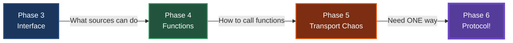
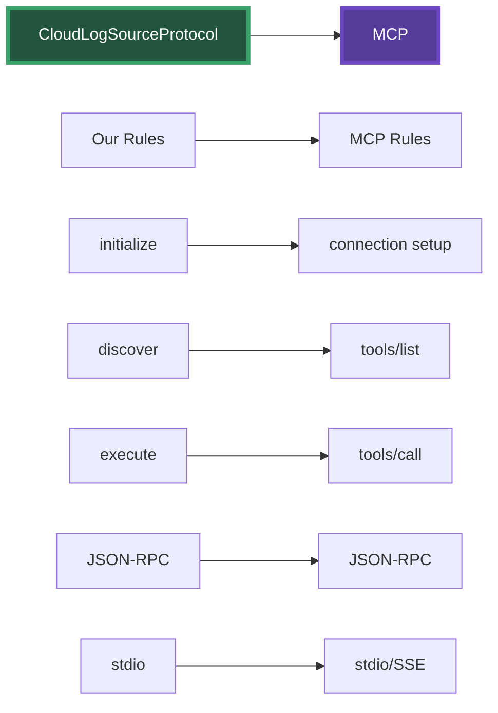

Current directory: /Users/abhishek/workspace/projects/mcp-first-principles
Current git state: branch 05-transport-standardization with transport multiplication

Create git branch 06-protocol-revelation that shows the grand protocol revelation and MCP connection.

Requirements:

1. First, create and checkout the branch:
```bash
git checkout -b 06-protocol-revelation
```

2. Create the comprehensive markdown file docs/06-protocol-revelation.md:
```markdown
# Phase 6: The Protocol Revelation

## The Big Insight

Looking at our transport chaos, a revolutionary idea emerges:

> "What if we just picked ONE way to communicate and made EVERYONE use it?"

---

## Our Journey of Standardization



We've been building toward this:
1. **Standardized Interface** - CloudLogSource (what they do)
2. **Standardized Functions** - Uniform signatures (how to call)
3. **Now: Standardized Transport** - One way to communicate

---

## What Makes a Protocol?

A protocol isn't just an API. It's a complete specification:

### API vs Protocol
- **API**: "Here's what you can do" (operations)
- **Protocol**: "Here's HOW you MUST do it" (rules)

### Our Protocol Rules
1. **Transport**: stdio only (stdin/stdout)
2. **Format**: JSON-RPC 2.0 only
3. **Lifecycle**: initialize → discover → execute
4. **Errors**: Standard JSON-RPC error codes
5. **Discovery**: Standard method to list capabilities

---

## CloudLogSourceProtocol Specification

```java
/**
 * CloudLogSource Protocol Specification v1.0
 * 
 * TRANSPORT RULES:
 * - Communication MUST use stdio
 * - Each message MUST be a JSON object on a single line
 * - Each message MUST end with newline
 * 
 * MESSAGE FORMAT:
 * - All messages MUST follow JSON-RPC 2.0
 * - Requests: {"jsonrpc":"2.0","method":"...","params":{...},"id":"..."}
 * - Responses: {"jsonrpc":"2.0","result":{...},"id":"..."}
 * 
 * REQUIRED METHODS:
 * 1. initialize - Establish connection
 * 2. discover - List available operations  
 * 3. execute - Perform an operation
 */
```

---

## The Benefits

### Before: Transport Multiplication
- 2 sources × 4 transports = 8 implementations
- Different auth for each
- Different errors for each
- Different discovery for each

### After: One Protocol
- 2 sources × 1 protocol = 2 implementations
- Standard auth negotiation
- Standard error codes
- Standard discovery

---

## The Big Reveal: This IS MCP!



We didn't set out to build MCP - we arrived here by solving real problems!

---

## Speaker Notes

### Opening (2 min)
1. Start with the question: "What if we picked ONE way?"
2. Show our standardization journey
3. "Let's create a protocol!"

### Code Walkthrough (8 min)

#### First: CloudLogSourceProtocol.java
- Walk through the Javadoc specification
- "This isn't just an interface - it's a rulebook"
- Point out: transport rules, message format, lifecycle
- "Everyone MUST follow these rules"

#### Second: Protocol Implementation
- Show CloudLogSourceProtocolServer
- "One implementation, works for any source"
- Show how it wraps ANY CloudLogSource

#### Third: Universal Client
- Show CloudLogSourceProtocolClient
- "This client works with AWS, GCP, any future source"
- "No source-specific code!"

#### Fourth: Demo
- Run the protocol demo
- Show same client talking to different sources
- "They all speak the same language now"

#### Fifth: The MCP Reveal
- Show MCPComparison.java
- Side-by-side comparison
- "We've built MCP!"

### Key Messages (3 min)
- Protocols emerge from real problems
- Restrictions enable interoperability
- We built this naturally, not forced
- MCP is the same pattern at scale

### Closing (2 min)
- "You now understand MCP from first principles"
- "It's not magic - it's good engineering"
- "Go build MCP servers for your tools!"
```

3. Create CloudLogSourceProtocol.java with full specification:
```java
package com.watchtower.protocol;

/**
 * CloudLogSource Protocol Specification v1.0
 * 
 * This protocol standardizes how clients communicate with CloudLogSource servers.
 * ALL implementations MUST follow these rules exactly.
 * 
 * TRANSPORT RULES:
 * - Communication MUST use stdio (stdin for requests, stdout for responses)
 * - Servers MUST read from stdin and write to stdout
 * - Each message MUST be a complete JSON object on a single line
 * - Each message MUST be terminated with a newline character (\n)
 * - Servers MUST NOT write anything else to stdout
 * 
 * MESSAGE FORMAT:
 * - All messages MUST follow JSON-RPC 2.0 specification
 * - Request format:
 *   {
 *     "jsonrpc": "2.0",
 *     "method": "methodName",
 *     "params": { ... },
 *     "id": "unique-id"
 *   }
 * 
 * - Success response format:
 *   {
 *     "jsonrpc": "2.0",
 *     "result": { ... },
 *     "id": "matching-request-id"
 *   }
 * 
 * - Error response format:
 *   {
 *     "jsonrpc": "2.0",
 *     "error": {
 *       "code": -32601,
 *       "message": "Method not found",
 *       "data": { ... }  // optional
 *     },
 *     "id": "matching-request-id"
 *   }
 * 
 * REQUIRED METHODS:
 * 
 * 1. "initialize"
 *    Purpose: Establish connection and exchange capabilities
 *    Params: {
 *      "protocol_version": "1.0",
 *      "client_info": { "name": "...", "version": "..." }
 *    }
 *    Result: {
 *      "protocol_version": "1.0",
 *      "server_info": { "name": "...", "version": "...", "provider": "..." },
 *      "capabilities": { ... }
 *    }
 * 
 * 2. "discover"
 *    Purpose: List available operations
 *    Params: {}
 *    Result: {
 *      "operations": [
 *        {
 *          "name": "fetchLogs",
 *          "description": "...",
 *          "parameters": { ... }
 *        },
 *        ...
 *      ]
 *    }
 * 
 * 3. "execute"
 *    Purpose: Execute a specific operation
 *    Params: {
 *      "operation": "operationName",
 *      "arguments": { ... }
 *    }
 *    Result: (operation-specific)
 * 
 * ERROR CODES:
 * - -32700: Parse error (invalid JSON)
 * - -32600: Invalid request (missing required fields)
 * - -32601: Method not found
 * - -32602: Invalid params
 * - -32603: Internal error
 * 
 * LIFECYCLE:
 * 1. Client sends "initialize" request
 * 2. Server responds with capabilities
 * 3. Client sends "discover" to learn operations
 * 4. Client sends "execute" for specific operations
 * 5. Either party closes stdin to end session
 * 
 * EXAMPLE SESSION:
 * C: {"jsonrpc":"2.0","method":"initialize","params":{"protocol_version":"1.0"},"id":"1"}
 * S: {"jsonrpc":"2.0","result":{"protocol_version":"1.0","server_info":{...}},"id":"1"}
 * C: {"jsonrpc":"2.0","method":"discover","params":{},"id":"2"}
 * S: {"jsonrpc":"2.0","result":{"operations":[...]},"id":"2"}
 * C: {"jsonrpc":"2.0","method":"execute","params":{"operation":"fetchLogs",...},"id":"3"}
 * S: {"jsonrpc":"2.0","result":{...},"id":"3"}
 */
public interface CloudLogSourceProtocol {
    /**
     * Handle a protocol request and return a protocol response.
     * Implementations MUST support all required methods.
     */
    ProtocolResponse handleRequest(ProtocolRequest request);
}
```

4. Create protocol message classes:
```java
package com.watchtower.protocol;

import lombok.AllArgsConstructor;
import lombok.Builder;
import lombok.Data;
import lombok.NoArgsConstructor;
import java.util.Map;

/**
 * JSON-RPC 2.0 Request
 */
@Data
@Builder
@NoArgsConstructor
@AllArgsConstructor
public class ProtocolRequest {
    private String jsonrpc = "2.0";
    private String method;
    private Map<String, Object> params;
    private String id;
}

/**
 * JSON-RPC 2.0 Response
 */
@Data
@Builder
@NoArgsConstructor
@AllArgsConstructor
public class ProtocolResponse {
    private String jsonrpc = "2.0";
    private Object result;
    private ProtocolError error;
    private String id;
    
    public static ProtocolResponse success(String id, Object result) {
        return ProtocolResponse.builder()
            .jsonrpc("2.0")
            .id(id)
            .result(result)
            .build();
    }
    
    public static ProtocolResponse error(String id, int code, String message) {
        return ProtocolResponse.builder()
            .jsonrpc("2.0")
            .id(id)
            .error(new ProtocolError(code, message, null))
            .build();
    }
}

/**
 * JSON-RPC 2.0 Error
 */
@Data
@AllArgsConstructor
@NoArgsConstructor
public class ProtocolError {
    private int code;
    private String message;
    private Object data;
    
    // Standard error codes
    public static final int PARSE_ERROR = -32700;
    public static final int INVALID_REQUEST = -32600;
    public static final int METHOD_NOT_FOUND = -32601;
    public static final int INVALID_PARAMS = -32602;
    public static final int INTERNAL_ERROR = -32603;
}
```

5. Create CloudLogSourceProtocolServer.java:
```java
package com.watchtower.protocol;

import com.watchtower.sources.CloudLogSource;
import com.watchtower.model.*;
import java.util.*;

/**
 * Protocol server that wraps ANY CloudLogSource
 * 
 * This single implementation replaces all transport-specific wrappers!
 */
public class CloudLogSourceProtocolServer implements CloudLogSourceProtocol {
    private final CloudLogSource source;
    private final String sourceName;
    private boolean initialized = false;
    
    public CloudLogSourceProtocolServer(CloudLogSource source, String sourceName) {
        this.source = source;
        this.sourceName = sourceName;
    }
    
    @Override
    public ProtocolResponse handleRequest(ProtocolRequest request) {
        // Validate request
        if (request.getMethod() == null || request.getId() == null) {
            return ProtocolResponse.error(
                request.getId(),
                ProtocolError.INVALID_REQUEST,
                "Missing required fields"
            );
        }
        
        try {
            return switch (request.getMethod()) {
                case "initialize" -> handleInitialize(request);
                case "discover" -> handleDiscover(request);
                case "execute" -> handleExecute(request);
                default -> ProtocolResponse.error(
                    request.getId(),
                    ProtocolError.METHOD_NOT_FOUND,
                    "Unknown method: " + request.getMethod()
                );
            };
        } catch (Exception e) {
            return ProtocolResponse.error(
                request.getId(),
                ProtocolError.INTERNAL_ERROR,
                e.getMessage()
            );
        }
    }
    
    private ProtocolResponse handleInitialize(ProtocolRequest request) {
        Map<String, Object> params = request.getParams();
        String protocolVersion = (String) params.get("protocol_version");
        
        if (!"1.0".equals(protocolVersion)) {
            return ProtocolResponse.error(
                request.getId(),
                ProtocolError.INVALID_PARAMS,
                "Unsupported protocol version"
            );
        }
        
        // Initialize the source with environment credentials
        Map<String, String> config = new HashMap<>();
        if ("AWS".equals(sourceName)) {
            config.put("AWS_ACCESS_KEY_ID", System.getenv("AWS_ACCESS_KEY_ID"));
            config.put("AWS_SECRET_ACCESS_KEY", System.getenv("AWS_SECRET_ACCESS_KEY"));
        } else if ("GCP".equals(sourceName)) {
            config.put("GOOGLE_APPLICATION_CREDENTIALS", System.getenv("GOOGLE_APPLICATION_CREDENTIALS"));
        }
        
        source.initialize(config);
        initialized = true;
        
        // Return server info and capabilities
        return ProtocolResponse.success(request.getId(), Map.of(
            "protocol_version", "1.0",
            "server_info", Map.of(
                "name", sourceName + " CloudLogSource",
                "version", "1.0",
                "provider", source.getCloudProvider()
            ),
            "capabilities", source.getCapabilities()
        ));
    }
    
    private ProtocolResponse handleDiscover(ProtocolRequest request) {
        if (!initialized) {
            return ProtocolResponse.error(
                request.getId(),
                ProtocolError.INVALID_REQUEST,
                "Not initialized"
            );
        }
        
        // Describe available operations
        List<Map<String, Object>> operations = List.of(
            Map.of(
                "name", "fetchLogs",
                "description", "Fetch logs from " + sourceName,
                "parameters", Map.of(
                    "resource", Map.of("type", "string", "description", "Service name"),
                    "filter", Map.of("type", "string", "description", "Log level filter"),
                    "limit", Map.of("type", "integer", "description", "Maximum logs")
                )
            ),
            Map.of(
                "name", "fetchMetrics",
                "description", "Fetch metrics from " + sourceName,
                "parameters", Map.of(
                    "resource", Map.of("type", "string", "description", "Service name"),
                    "metricName", Map.of("type", "string", "description", "Metric to fetch"),
                    "timeRange", Map.of("type", "string", "description", "Time range")
                )
            )
        );
        
        return ProtocolResponse.success(request.getId(), Map.of(
            "operations", operations
        ));
    }
    
    private ProtocolResponse handleExecute(ProtocolRequest request) {
        if (!initialized) {
            return ProtocolResponse.error(
                request.getId(),
                ProtocolError.INVALID_REQUEST,
                "Not initialized"
            );
        }
        
        Map<String, Object> params = request.getParams();
        String operation = (String) params.get("operation");
        Map<String, Object> arguments = (Map<String, Object>) params.get("arguments");
        
        if (operation == null || arguments == null) {
            return ProtocolResponse.error(
                request.getId(),
                ProtocolError.INVALID_PARAMS,
                "Missing operation or arguments"
            );
        }
        
        try {
            Object result = switch (operation) {
                case "fetchLogs" -> {
                    String resource = (String) arguments.get("resource");
                    String filter = (String) arguments.get("filter");
                    Integer limit = (Integer) arguments.get("limit");
                    
                    List<LogEntry> logs = source.fetchLogs(resource, filter, limit);
                    yield Map.of(
                        "logs", logs,
                        "count", logs.size(),
                        "source", sourceName
                    );
                }
                
                case "fetchMetrics" -> {
                    String resource = (String) arguments.get("resource");
                    String metricName = (String) arguments.get("metricName");
                    String timeRange = (String) arguments.get("timeRange");
                    
                    List<Metric> metrics = source.fetchMetrics(resource, metricName, timeRange);
                    yield Map.of(
                        "metrics", metrics,
                        "count", metrics.size(),
                        "source", sourceName
                    );
                }
                
                default -> throw new IllegalArgumentException("Unknown operation: " + operation);
            };
            
            return ProtocolResponse.success(request.getId(), result);
            
        } catch (Exception e) {
            return ProtocolResponse.error(
                request.getId(),
                ProtocolError.INTERNAL_ERROR,
                "Operation failed: " + e.getMessage()
            );
        }
    }
}
```

6. Create CloudLogSourceProtocolClient.java:
```java
package com.watchtower.protocol;

import com.fasterxml.jackson.databind.ObjectMapper;
import java.io.*;
import java.util.Map;
import java.util.UUID;

/**
 * Universal client for ANY CloudLogSource that implements the protocol
 * 
 * This ONE client replaces all transport-specific clients!
 */
public class CloudLogSourceProtocolClient implements Closeable {
    private final Process serverProcess;
    private final BufferedReader reader;
    private final BufferedWriter writer;
    private final ObjectMapper json = new ObjectMapper();
    
    /**
     * Connect to a CloudLogSource server via stdio
     */
    public static CloudLogSourceProtocolClient connect(String command) throws IOException {
        ProcessBuilder pb = new ProcessBuilder(command.split(" "));
        Process process = pb.start();
        
        BufferedReader reader = new BufferedReader(
            new InputStreamReader(process.getInputStream())
        );
        BufferedWriter writer = new BufferedWriter(
            new OutputStreamWriter(process.getOutputStream())
        );
        
        return new CloudLogSourceProtocolClient(process, reader, writer);
    }
    
    private CloudLogSourceProtocolClient(Process process, BufferedReader reader, BufferedWriter writer) {
        this.serverProcess = process;
        this.reader = reader;
        this.writer = writer;
    }
    
    /**
     * Initialize the connection
     */
    public Map<String, Object> initialize() throws IOException {
        ProtocolRequest request = ProtocolRequest.builder()
            .method("initialize")
            .params(Map.of(
                "protocol_version", "1.0",
                "client_info", Map.of(
                    "name", "CloudLogSourceProtocolClient",
                    "version", "1.0"
                )
            ))
            .id(generateId())
            .build();
            
        ProtocolResponse response = sendRequest(request);
        if (response.getError() != null) {
            throw new RuntimeException("Initialize failed: " + response.getError().getMessage());
        }
        
        return (Map<String, Object>) response.getResult();
    }
    
    /**
     * Discover available operations
     */
    public Map<String, Object> discover() throws IOException {
        ProtocolRequest request = ProtocolRequest.builder()
            .method("discover")
            .params(Map.of())
            .id(generateId())
            .build();
            
        ProtocolResponse response = sendRequest(request);
        if (response.getError() != null) {
            throw new RuntimeException("Discover failed: " + response.getError().getMessage());
        }
        
        return (Map<String, Object>) response.getResult();
    }
    
    /**
     * Execute an operation
     */
    public Map<String, Object> execute(String operation, Map<String, Object> arguments) throws IOException {
        ProtocolRequest request = ProtocolRequest.builder()
            .method("execute")
            .params(Map.of(
                "operation", operation,
                "arguments", arguments
            ))
            .id(generateId())
            .build();
            
        ProtocolResponse response = sendRequest(request);
        if (response.getError() != null) {
            throw new RuntimeException("Execute failed: " + response.getError().getMessage());
        }
        
        return (Map<String, Object>) response.getResult();
    }
    
    private ProtocolResponse sendRequest(ProtocolRequest request) throws IOException {
        // Send request as single line JSON
        String requestJson = json.writeValueAsString(request);
        writer.write(requestJson);
        writer.newLine();
        writer.flush();
        
        // Read response as single line JSON
        String responseJson = reader.readLine();
        if (responseJson == null) {
            throw new IOException("Server closed connection");
        }
        
        return json.readValue(responseJson, ProtocolResponse.class);
    }
    
    private String generateId() {
        return UUID.randomUUID().toString();
    }
    
    @Override
    public void close() throws IOException {
        writer.close();
        reader.close();
        serverProcess.destroy();
    }
}
```

7. Create protocol server runners:

AWSProtocolServerMain.java:
```java
package com.watchtower.protocol.servers;

import com.watchtower.protocol.*;
import com.watchtower.sources.AWSLogSource;
import com.fasterxml.jackson.databind.ObjectMapper;
import java.io.*;

/**
 * AWS CloudLogSource exposed via the protocol
 */
public class AWSProtocolServerMain {
    public static void main(String[] args) throws Exception {
        // Create AWS source
        AWSLogSource awsSource = new AWSLogSource();
        CloudLogSourceProtocolServer server = new CloudLogSourceProtocolServer(awsSource, "AWS");
        
        // JSON mapper
        ObjectMapper json = new ObjectMapper();
        
        // Read from stdin, write to stdout
        BufferedReader reader = new BufferedReader(new InputStreamReader(System.in));
        BufferedWriter writer = new BufferedWriter(new OutputStreamWriter(System.out));
        
        // Protocol loop
        String line;
        while ((line = reader.readLine()) != null) {
            try {
                // Parse request
                ProtocolRequest request = json.readValue(line, ProtocolRequest.class);
                
                // Handle request
                ProtocolResponse response = server.handleRequest(request);
                
                // Send response
                writer.write(json.writeValueAsString(response));
                writer.newLine();
                writer.flush();
                
            } catch (Exception e) {
                // Protocol error
                ProtocolResponse error = ProtocolResponse.error(
                    null,
                    ProtocolError.PARSE_ERROR,
                    e.getMessage()
                );
                writer.write(json.writeValueAsString(error));
                writer.newLine();
                writer.flush();
            }
        }
    }
}
```

GCPProtocolServerMain.java:
```java
package com.watchtower.protocol.servers;

import com.watchtower.protocol.*;
import com.watchtower.sources.GCPLogSource;
import com.fasterxml.jackson.databind.ObjectMapper;
import java.io.*;

/**
 * GCP CloudLogSource exposed via the protocol
 */
public class GCPProtocolServerMain {
    public static void main(String[] args) throws Exception {
        // Create GCP source
        GCPLogSource gcpSource = new GCPLogSource();
        CloudLogSourceProtocolServer server = new CloudLogSourceProtocolServer(gcpSource, "GCP");
        
        // Same protocol handling as AWS!
        ObjectMapper json = new ObjectMapper();
        BufferedReader reader = new BufferedReader(new InputStreamReader(System.in));
        BufferedWriter writer = new BufferedWriter(new OutputStreamWriter(System.out));
        
        String line;
        while ((line = reader.readLine()) != null) {
            try {
                ProtocolRequest request = json.readValue(line, ProtocolRequest.class);
                ProtocolResponse response = server.handleRequest(request);
                
                writer.write(json.writeValueAsString(response));
                writer.newLine();
                writer.flush();
                
            } catch (Exception e) {
                ProtocolResponse error = ProtocolResponse.error(
                    null,
                    ProtocolError.PARSE_ERROR,
                    e.getMessage()
                );
                writer.write(json.writeValueAsString(error));
                writer.newLine();
                writer.flush();
            }
        }
    }
}
```

8. Create ProtocolDemo.java:
```java
package com.watchtower.protocol;

import java.util.Map;

/**
 * Demonstrates the CloudLogSource Protocol in action
 */
public class ProtocolDemo {
    
    public static void main(String[] args) throws Exception {
        System.out.println(">>> CloudLogSource Protocol Demo");
        System.out.println(">>> =============================");
        System.out.println();
        System.out.println(">>> ONE client for ALL sources!");
        System.out.println();
        
        // Demo with AWS
        demoSource("AWS", "java -cp target/classes com.watchtower.protocol.servers.AWSProtocolServerMain");
        
        System.out.println("\n" + "=".repeat(60) + "\n");
        
        // Demo with GCP - same client!
        demoSource("GCP", "java -cp target/classes com.watchtower.protocol.servers.GCPProtocolServerMain");
        
        System.out.println("\n>>> Notice: Same client code works with both sources!");
        System.out.println(">>> This is the power of protocols!");
    }
    
    private static void demoSource(String name, String command) throws Exception {
        System.out.println(">>> Connecting to " + name + " via protocol...");
        
        try (CloudLogSourceProtocolClient client = CloudLogSourceProtocolClient.connect(command)) {
            
            // Initialize
            System.out.println("\n1. Initialize:");
            Map<String, Object> initResult = client.initialize();
            System.out.println("   Server: " + initResult.get("server_info"));
            
            // Discover
            System.out.println("\n2. Discover operations:");
            Map<String, Object> discoverResult = client.discover();
            System.out.println("   Available: " + discoverResult.get("operations"));
            
            // Execute
            System.out.println("\n3. Execute fetchLogs:");
            Map<String, Object> logsResult = client.execute("fetchLogs", Map.of(
                "resource", "payment-service",
                "filter", "ERROR",
                "limit", 5
            ));
            System.out.println("   Found " + logsResult.get("count") + " logs from " + logsResult.get("source"));
            
            System.out.println("\n4. Execute fetchMetrics:");
            Map<String, Object> metricsResult = client.execute("fetchMetrics", Map.of(
                "resource", "payment-service",
                "metricName", "error_rate",
                "timeRange", "1h"
            ));
            System.out.println("   Found " + metricsResult.get("count") + " metrics from " + metricsResult.get("source"));
        }
    }
}
```

9. Create MCPComparison.java:
```java
package com.watchtower.protocol;

/**
 * Shows how our CloudLogSourceProtocol maps to real MCP
 */
public class MCPComparison {
    
    public static void main(String[] args) {
        System.out.println(">>> CloudLogSourceProtocol vs Model Context Protocol (MCP)");
        System.out.println(">>> =====================================================");
        System.out.println();
        
        System.out.println("TRANSPORT:");
        System.out.println("  CloudLogSourceProtocol: stdio (stdin/stdout)");
        System.out.println("  MCP:                    stdio or SSE");
        System.out.println("  >>> Same approach! (MCP adds SSE for web support)");
        System.out.println();
        
        System.out.println("MESSAGE FORMAT:");
        System.out.println("  CloudLogSourceProtocol: JSON-RPC 2.0");
        System.out.println("  MCP:                    JSON-RPC 2.0");
        System.out.println("  >>> Identical!");
        System.out.println();
        
        System.out.println("LIFECYCLE:");
        System.out.println("  CloudLogSourceProtocol: initialize → discover → execute");
        System.out.println("  MCP:                    initialize → tools/list → tools/call");
        System.out.println("  >>> Same pattern!");
        System.out.println();
        
        System.out.println("DISCOVERY:");
        System.out.println("  CloudLogSourceProtocol: 'discover' returns operations");
        System.out.println("  MCP:                    'tools/list' returns available tools");
        System.out.println("  >>> Same concept!");
        System.out.println();
        
        System.out.println("EXECUTION:");
        System.out.println("  CloudLogSourceProtocol: 'execute' with operation name");
        System.out.println("  MCP:                    'tools/call' with tool name");
        System.out.println("  >>> Same pattern!");
        System.out.println();
        
        System.out.println("ERROR HANDLING:");
        System.out.println("  CloudLogSourceProtocol: JSON-RPC error codes");
        System.out.println("  MCP:                    JSON-RPC error codes");
        System.out.println("  >>> Identical!");
        System.out.println();
        
        System.out.println("=".repeat(60));
        System.out.println();
        System.out.println(">>> We've essentially built MCP from first principles!");
        System.out.println(">>> This isn't coincidence - it's convergent evolution.");
        System.out.println(">>> Good engineering leads to similar solutions.");
        System.out.println();
        System.out.println(">>> What MCP adds:");
        System.out.println("    - Broader ecosystem support");
        System.out.println("    - SSE transport for web environments");
        System.out.println("    - Resource management");
        System.out.println("    - Sampling and progress reporting");
        System.out.println("    - But the core idea is identical!");
    }
}
```

10. Create ProtocolTest.java:
```java
package com.watchtower.protocol;

import org.junit.jupiter.api.Test;
import org.junit.jupiter.api.DisplayName;
import java.util.Map;
import static org.assertj.core.api.Assertions.assertThat;

/**
 * Tests demonstrating the protocol in action
 */
class ProtocolTest {
    
    @Test
    @DisplayName("Protocol eliminates transport multiplication")
    void showProtocolBenefits() {
        System.out.println("\n" + "=".repeat(60));
        System.out.println(">>> PROTOCOL BENEFITS");
        System.out.println("=".repeat(60));
        
        System.out.println("\nBEFORE (Transport Multiplication):");
        System.out.println("- AWS REST API");
        System.out.println("- AWS gRPC Service");
        System.out.println("- AWS CLI");
        System.out.println("- GCP REST API");
        System.out.println("- GCP gRPC Service");
        System.out.println("- GCP CLI");
        System.out.println("Total: 6 implementations");
        
        System.out.println("\nAFTER (Protocol):");
        System.out.println("- AWS Protocol Server");
        System.out.println("- GCP Protocol Server");
        System.out.println("- One Protocol Client");
        System.out.println("Total: 3 implementations");
        
        System.out.println("\nReduction: 50%!");
    }
    
    @Test
    @DisplayName("Same protocol message format for all sources")
    void showStandardMessages() {
        System.out.println("\n" + "=".repeat(60));
        System.out.println(">>> STANDARD MESSAGE FORMAT");
        System.out.println("=".repeat(60));
        
        // Show standard request format
        ProtocolRequest request = ProtocolRequest.builder()
            .jsonrpc("2.0")
            .method("execute")
            .params(Map.of(
                "operation", "fetchLogs",
                "arguments", Map.of(
                    "resource", "payment-service",
                    "filter", "ERROR",
                    "limit", 100
                )
            ))
            .id("test-123")
            .build();
            
        System.out.println("\nStandard Request (works with ANY source):");
        System.out.println(request);
        
        // Show standard response format
        ProtocolResponse response = ProtocolResponse.success("test-123", Map.of(
            "logs", "...",
            "count", 100
        ));
        
        System.out.println("\nStandard Response (from ANY source):");
        System.out.println(response);
        
        System.out.println("\n>>> One format for all!");
    }
}
```

IMPORTANT:
- Shows how all our standardizations led to a protocol
- CloudLogSourceProtocol has clear, documented rules
- One client works with any protocol-compliant server
- Direct comparison shows we've built MCP
- The revelation feels natural and earned

After creating these files:
1. Run `./validate.sh` to ensure everything compiles
2. Open `docs/06-protocol-revelation.md` in IntelliJ markdown preview
3. Walk through the protocol specification in detail
4. Show how one client works with all sources
5. Run MCPComparison to reveal the MCP connection
6. Commit: `git add . && git commit -m "Protocol Revelation: We've built MCP!"`