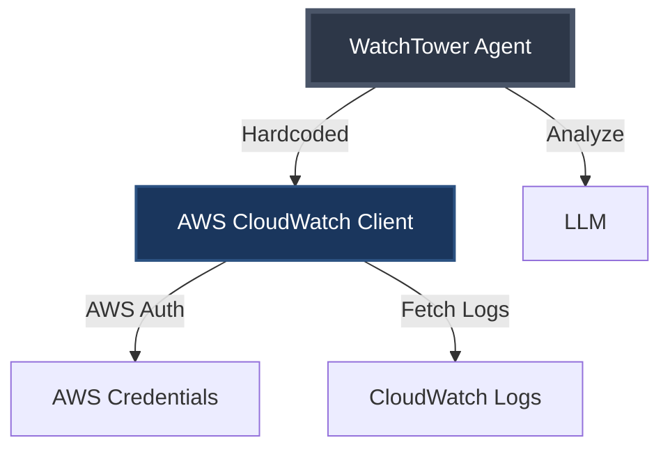
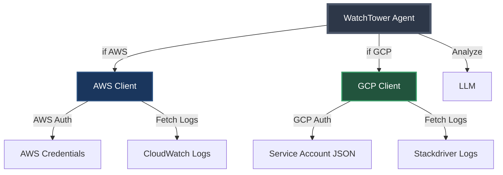

# Phase 2: Customer Pressure - Adding GCP

## The Story So Far

Our AWS-only WatchTower.AI launched last month. Customer adoption has been strong, but now we're getting urgent requests...

> **Support Ticket #1247**: "We need GCP support ASAP. Half our infrastructure runs on Google Cloud."
> 
> **Sales Team**: "We're about to lose our biggest deal - they won't sign without multi-cloud support."
> 
> **Customer Feedback**: "Love the product, but we can't adopt it for just AWS. When is GCP coming?"

---

## The Current Architecture



## The Quick Fix Approach

"How hard can it be? Just add GCP support!"



---

## The Authentication Problem

### AWS Pattern
```java
// AWS uses access keys
Map<String, String> awsCredentials = Map.of(
    "accessKeyId", System.getenv("AWS_ACCESS_KEY_ID"),
    "secretAccessKey", System.getenv("AWS_SECRET_ACCESS_KEY"),
    "region", "us-east-1"
);
```

### GCP Pattern
```java
// GCP uses service account files
String gcpServiceAccount = System.getenv("GOOGLE_APPLICATION_CREDENTIALS");
// Points to a JSON file with credentials
```

**Key Difference**: AWS uses key/secret pairs, GCP uses JSON files

---

## What We're About to Build

- Copy-paste AWS code for GCP
- Add if-else statements everywhere
- Duplicate similar logic with slight variations
- Create a maintenance nightmare

## The Code Smells

🚨 **Warning Signs**:
- Constructor getting complex
- Conditional logic spreading
- Similar but not identical code
- No clear abstraction boundary

---

## Speaker Notes

### Opening
- Start with the customer quote - make it dramatic
- Show how successful MVP leads to new requirements
- This is a VERY common scenario

### Architecture Diagrams
- First diagram: Show current simple architecture
- Second diagram: Show the "obvious" solution
- Point out how messy it's already getting

### Key Points to Emphasize
1. **Different Auth Patterns**: AWS uses key/secret, GCP uses service account JSON
2. **Similar But Different APIs**: Both fetch logs, but differently
3. **The Temptation**: "Just copy and modify" seems fastest
4. **The Future Problem**: What happens with Azure? DataDog? Splunk?

### Transition to Code
"Let's see what this 'quick fix' looks like in practice..."

---

## After Implementation

Run the test in IntelliJ to show both AWS and GCP working.

Point out:
- How much code we duplicated
- The growing constructor
- The spreading if-else logic
- Ask: "What happens when we add Azure?"