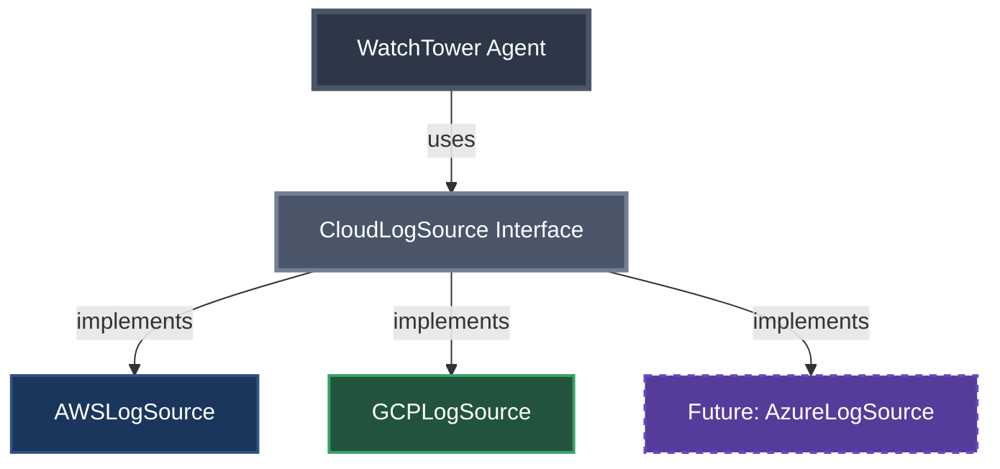

# Phase 3: First Refactor - Extract Interface

## The Pain We're Feeling

Looking at our code after adding GCP support:
- Constructor is getting complex
- If-else statements everywhere
- Similar but not identical code
- What happens when we add Azure? Or DataDog?

---

## The Solution: Extract Common Interface



## The Interface Design

```java
public interface CloudLogSource {
    // Common initialization pattern
    void initialize(Map<String, String> config);
    
    // Common log fetching pattern
    List<LogEntry> fetchLogs(String resource, String filter, int limit);
    
    // Common metrics fetching pattern
    List<Metric> fetchMetrics(String resource, String metricName, String timeRange);
    
    // Identify the source
    String getCloudProvider();
}
```

---

## Benefits of This Approach

### Before: Provider-Specific Knowledge Everywhere
```java
// Agent needs to know AWS uses "/aws/payment-service"
// Agent needs to know GCP uses "projects/PROJECT/logs/payment-service"
switch (provider) {
    case "AWS" -> source.fetchLogs("/aws/payment-service", "ERROR", 1000);
    case "GCP" -> source.fetchLogs("projects/my-gcp-project/logs/payment-service", "ERROR", 1000);
}
```

### After: Clean Abstraction
```java
// Agent uses logical names, sources handle translation
source.fetchLogs("payment-service", "ERROR", 1000);
source.fetchMetrics("payment-service", "error_rate", "1h");
```

The sources internally translate:
- AWS: "payment-service" → "/aws/payment-service"
- GCP: "payment-service" → "projects/my-gcp-project/logs/payment-service"

---

## But We Still Orchestrate Everything

```java
public String troubleshootErrors(String userQuery, String cloudProvider) {
    // WE decide to fetch logs first
    List<LogEntry> logs = source.fetchLogs("payment-service", "ERROR", 1000);
    
    // WE decide to also check metrics
    List<Metric> metrics = source.fetchMetrics("payment-service", "error_rate", "1h");
    
    // WE manually combine everything
    String context = formatLogsAndMetrics(logs, metrics);
    
    // LLM just analyzes what we give it
    return llm.complete("troubleshoot", context);
}
```

---

## Speaker Notes

### Opening (1 min)
- Show the if-else mess from Phase 2
- "What's the pattern? Both clouds do the same things differently"
- Time to apply classic OOP

### Code Walkthrough (5 min)
1. **CloudLogSource.java** - The common contract
2. **AWSLogSource.java** - AWS-specific implementation
3. **GCPLogSource.java** - GCP-specific implementation
4. **WatchTowerAgent.java** - Clean polymorphism, but...
5. Point out we still hardcode the orchestration

### Run Tests (1 min)
- Show all tests passing
- Demo the new metrics functionality
- "Cleaner code, same functionality"

### Key Messages
- Interface abstracts cloud differences
- Polymorphism eliminates if-else chains
- BUT we still decide what to fetch and when

### Transition (30 sec)
"What if the LLM could decide what data it needs?"

---

## The Hidden Problem

While our code is cleaner, we still have fundamental limitations:

- **We decide** what to fetch (hardcoded fetchLogs and fetchMetrics calls)
- **We decide** the order and combination
- **We build** the context manually
- **We format** everything for the LLM

```java
// We always fetch logs first, then metrics
List<LogEntry> logs = source.fetchLogs(...);
List<Metric> metrics = source.fetchMetrics(...);
// LLM has no say in this process!
```

This leads us to our next evolution: **Function Calling** - letting the LLM orchestrate data fetching.