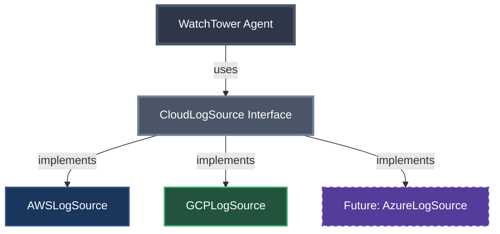

# Phase 3: First Refactor - Extract Interface

## The Pain We're Feeling

Looking at our code after adding GCP support:
- Constructor is getting complex
- If-else statements everywhere  
- Similar but not identical code
- What happens when we add Azure? Or DataDog?

---

## The Solution: Extract Common Interface



## The Interface Design

```java
public interface CloudLogSource {
    // Common initialization pattern
    void initialize(Map<String, String> config);
    
    // Common log fetching pattern
    List<LogEntry> fetchLogs(String resource, String filter, int limit);
    
    // Identify the source
    String getCloudProvider();
}
```

---

## Benefits of This Approach

### Before: Provider-Specific Knowledge Everywhere
```java
// Agent needs to know AWS uses "/aws/payment-service"
// Agent needs to know GCP uses "projects/PROJECT/logs/payment-service"
switch (provider) {
    case "AWS" -> source.fetchLogs("/aws/payment-service", "ERROR", 1000);
    case "GCP" -> source.fetchLogs("projects/my-gcp-project/logs/payment-service", "ERROR", 1000);
}
```

### After: Clean Abstraction
```java
// Agent uses logical names, sources handle translation
source.fetchLogs("payment-service", "ERROR", 1000);
```

The sources internally translate:
- AWS: "payment-service" → "/aws/payment-service"
- GCP: "payment-service" → "projects/my-gcp-project/logs/payment-service"

---

## Implementation Strategy

1. **Define the interface** - What's common across all clouds?
2. **Adapt existing code** - Wrap AWS and GCP clients
3. **Refactor the agent** - Use Map<String, CloudLogSource>
4. **Simplify the flow** - No more if-else chains

---

## Speaker Notes

### Opening
- Start by showing the pain in the current code
- Highlight the constructor mess and if-else chains
- Ask: "What's the pattern here?"

### Interface Introduction
- This is classic OOP - extract what varies
- Show how all clouds do similar things differently
- The interface captures the "what", not the "how"

### Key Teaching Points
1. **Abstraction**: Hide cloud-specific details
2. **Polymorphism**: Same interface, different implementations
3. **Open/Closed**: Open for extension (new clouds), closed for modification
4. **Dependency Inversion**: Depend on abstractions, not concrete implementations

### Code Walkthrough
1. Start with the interface definition
2. Show how AWS adapter implements it
3. Show how GCP adapter implements it
4. Refactor WatchTowerAgent to use the interface
5. Run tests - everything still works!

### Transition
"This is better, but notice we still don't have a way for the agent to discover what each source can do..."

---

## The Hidden Problem

While our code is cleaner, we still have limitations:
- Sources have hardcoded mappings for known services
- What if we need logs from a service not in the mapping?
- What if different sources support different operations?
- How does the agent know what's available?

This leads us to our next challenge: **Discovery**