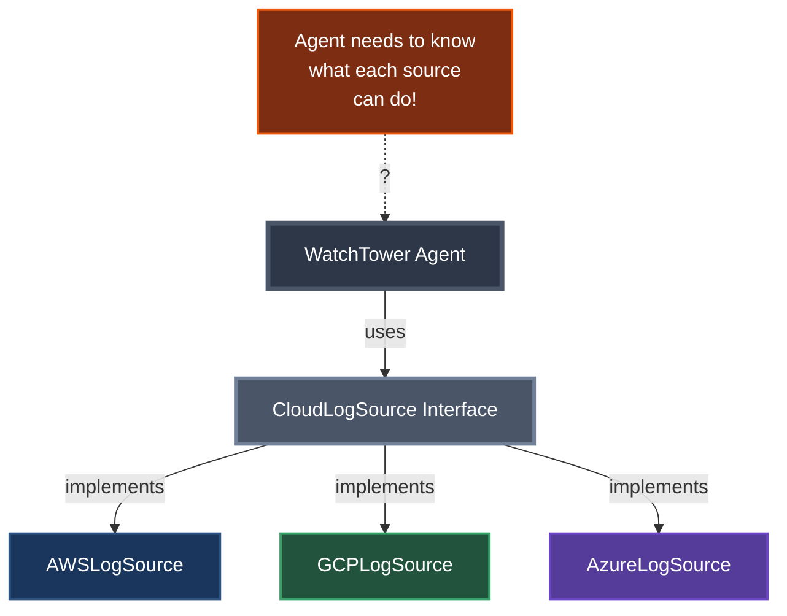
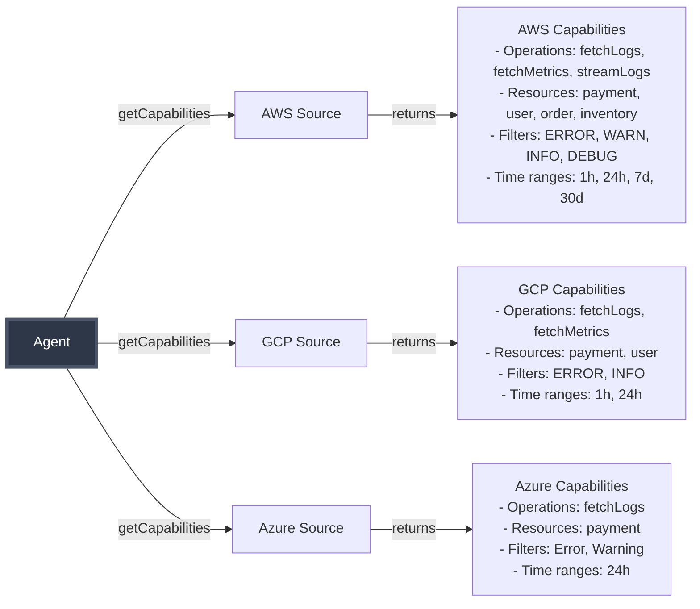

# Phase 4: Azure & The Discovery Problem

## New Requirements Arrive

Just when our code is looking clean...

> **Support Ticket #1893**: "We're migrating to Azure. Need support ASAP."
> 
> **Product Manager**: "Also, customers want daily summaries and anomaly detection, not just troubleshooting."
> 
> **Engineering Manager**: "How do we know what each cloud source can actually do?"

---

## Adding Azure - The Easy Part

Thanks to our interface, adding Azure is straightforward:



---

## The Real Problem: Discovery

### Current State: Hardcoded Knowledge
```java
// Agent just assumes all sources support these:
source.fetchLogs("payment-service", "ERROR", 1000);

// But what if:
// - Azure uses different resource names?
// - Some sources don't support certain filters?
// - We want to add new capabilities?
```

### What We Need: Source Capabilities
```java
public interface CloudLogSource {
    // Existing methods...
    
    // NEW: Discover what this source can do
    SourceCapabilities getCapabilities();
}

// Sources advertise raw capabilities, not personas
SourceCapabilities {
    supportedOperations: [fetchLogs, fetchMetrics, streamLogs]
    supportedFilters: [ERROR, WARN, INFO]
    supportedResources: [payment-service, user-service, order-service]
}
```

The Agent/LLM decides how to use these capabilities for each persona!

---

## Capability Discovery Pattern



---

## Adding Multiple Personas

Now that we can discover capabilities, let's add the requested features:

```java
public class WatchTowerAgent {
    // Troubleshooting (existing)
    public String troubleshootErrors(String query, String provider);
    
    // Daily Summary (new)
    public String generateSummary(String timeRange, String provider);
    
    // Anomaly Detection (new)
    public String detectAnomalies(String baseline, String provider);
}
```

The agent uses LLM to decide which source capabilities to use for each persona:
- **Troubleshoot**: Needs `fetchLogs` with ERROR filter
- **Summary**: Needs `fetchLogs` and ideally `fetchMetrics`
- **Anomaly**: Needs historical data, metrics, and statistical analysis

---

## Speaker Notes

### Opening (1 min)
1. Show the new requirements coming in (support tickets, PM requests)
2. Emphasize that adding Azure should be easy thanks to our interface
3. But there's a deeper problem lurking...

### Code Walkthrough Order (4 min)

#### First: Show the easy part - AzureLogSource.java
- Point out how it just implements CloudLogSource
- Note it has fewer capabilities than AWS
- "Adding a new cloud is now trivial!"

#### Second: Show the problem - WatchTowerAgent.java (old version)
- Show the hardcoded assumptions about what sources can do
- "But how does the agent know what each source supports?"

#### Third: Introduce SourceCapabilities.java
- Walk through the fields: operations, resources, filters, time ranges
- "Sources advertise what they CAN do, not what they're FOR"
- Key point: No mention of personas here!

#### Fourth: Show updated CloudLogSource interface
- Just added getCapabilities() method
- "Now sources can tell us what they support"

#### Fifth: Compare capabilities across sources
- Open AWSLogSource → show rich capabilities
- Open GCPLogSource → show moderate capabilities  
- Open AzureLogSource → show limited capabilities
- "AWS CloudWatch is clearly the most feature-rich"

#### Sixth: Show updated WatchTowerAgent
- Walk through troubleshootErrors() first
  - Show how it checks for "fetchLogs" operation
  - "The LLM decides what operations to use for troubleshooting"
- Then generateSummary()
  - Show time range checking
  - Note the "metrics available" flag
- Finally detectAnomalies()
  - Show the need for long-term data
  - "Some personas need specific capabilities"

### Run the Tests (2 min)
1. Run discovery test first - shows all capabilities
2. Run AWS tests - all three personas work
3. Run GCP tests - anomaly fails due to limited time range
4. Run Azure tests - only troubleshooting works

### Key Messages
- "We've separated WHAT sources can do from HOW the agent uses them"
- "The agent/LLM orchestrates available capabilities for each use case"
- "This is exactly the pattern MCP uses - sources advertise, clients adapt"

### Transition (30 sec)
"But we still have transport issues and authentication complexity. What if there was a standard way to handle all of this?"

---

## What's Still Missing

Even with discovery, we still have problems:
- How do we handle authentication uniformly?
- What about different transport mechanisms?
- How do we version these capabilities?

These are protocol-level concerns...