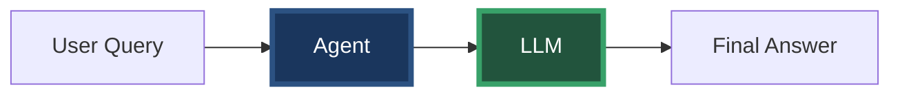
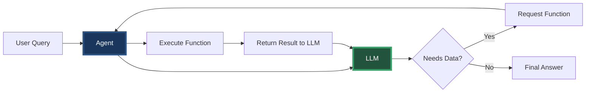

# Phase 4: Function Calling Revolution

## The Game Changer

June 2023: OpenAI announces function calling. Everything changes.

> "What if instead of the agent deciding what to fetch, the LLM could request exactly what it needs?"

---

## From Imperative to Declarative

### Before: We Orchestrate Everything
```java
// We decide the sequence
List<LogEntry> logs = source.fetchLogs(...);
List<Metric> metrics = source.fetchMetrics(...);
String context = combine(logs, metrics);
llm.complete(context);
```

### After: LLM Orchestrates
```java
// We describe what's available
List<Function> functions = describeFunctions();

// LLM decides what to call
while (llm.needsMoreData()) {
    FunctionCall call = llm.requestFunction();
    Object result = executeFunction(call);
    llm.processResult(result);
}
```

---

## The Agent-LLM Loop

Before


After


---

## Function Definitions

```java
// We describe available functions
List<FunctionDefinition> functions = List.of(
    new FunctionDefinition(
        "fetchLogs",
        "Fetch logs from cloud source",
        List.of(
            new Parameter("resource", "string", "Service name"),
            new Parameter("filter", "string", "Log level: ERROR, WARN, INFO"),
            new Parameter("limit", "integer", "Maximum logs to return")
        )
    ),
    new FunctionDefinition(
        "fetchMetrics",
        "Fetch metrics from cloud source",
        List.of(
            new Parameter("resource", "string", "Service name"),
            new Parameter("metricName", "string", "Metric: error_rate, cpu_usage"),
            new Parameter("timeRange", "string", "Range: 1h, 24h, 7d")
        )
    )
);
```

---

## Real Example: Dynamic Investigation

**User**: "Why are payments slow?"

**LLM**: "I'll investigate the payment performance. Let me start by checking recent logs."
- Calls: `fetchLogs("payment-service", "WARN", 1000)`

**LLM**: "I see latency warnings. Let me check the error rate."
- Calls: `fetchMetrics("payment-service", "error_rate", "1h")`

**LLM**: "Error rate is normal. Let me check CPU usage."
- Calls: `fetchMetrics("payment-service", "cpu_usage", "1h")`

**LLM**: "High CPU detected. Let me check database logs."
- Calls: `fetchLogs("database-service", "WARN", 500)`

**LLM**: "Found the issue: Database connection pool exhaustion is causing payment service CPU spikes due to retry storms."

---

## Speaker Notes

### Opening (1 min)
- Set the date: "June 2023 - OpenAI changes everything"
- The key insight: "What if LLMs could call functions?"
- "Let's see this in action"

### Code Walkthrough (6 min)

#### First: FunctionDefinition.java
- Show how we describe functions
- "It's like a menu for the LLM"
- Parameters have types and descriptions

#### Second: Updated WatchTowerAgent.java
- Show the new `analyzeWithFunctions` method
- Walk through the agent-LLM loop
- "The LLM drives, we execute"

#### Third: Live Example
- Run the test showing dynamic investigation
- Point out how LLM decides the sequence
- "It's like having a smart detective"

### Key Messages
- Shift from imperative to declarative
- LLM becomes the orchestrator
- More flexible and intelligent
- Same CloudLogSource, new interaction pattern

### Transition (30 sec)
"But we have a new problem: AWS and GCP expose their functions differently..."

---

## The New Challenge

Now we need to expose our CloudLogSource functions to the LLM, but:
- AWS team wants REST API
- GCP team wants gRPC
- Each with different function formats

This leads to our next challenge: **Transport Standardization**