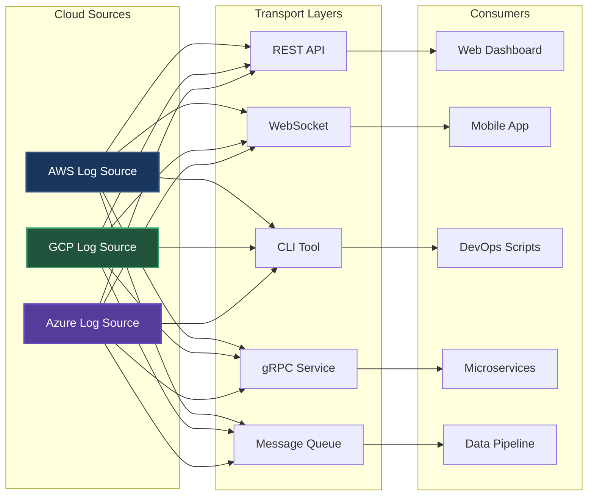

# Phase 5: Transport Chaos - The Server-Side Multiplication

## The Hidden Problem

We've abstracted our CloudLogSources nicely, but there's another issue lurking...

> **Integration Team**: "We need REST APIs for the web dashboard"
> 
> **DevOps Team**: "We need CLI tools for our scripts"
> 
> **Platform Team**: "We're standardizing on gRPC for all services"
> 
> **Data Team**: "Can you expose this via Kafka for our pipelines?"

---

## The Current Situation

Each CloudLogSource is just a Java interface. But teams need to access these sources differently:



**The Math**: 3 sources × 5 transports = 15 different server implementations!

---

## The Implementation Explosion

For EACH CloudLogSource, we need:

### REST API Server
```java
@RestController
@RequestMapping("/api/v1/aws")
public class AWSLogSourceREST {
    // GET /api/v1/aws/logs
    // POST /api/v1/aws/logs/search
    // GET /api/v1/aws/capabilities
}
```

### gRPC Server
```proto
service AWSLogService {
    rpc FetchLogs(LogRequest) returns (LogResponse);
    rpc StreamLogs(StreamRequest) returns (stream LogEntry);
    rpc GetCapabilities(Empty) returns (Capabilities);
}
```

### CLI Tool
```bash
aws-logs fetch --filter ERROR --limit 1000
aws-logs stream --follow
aws-logs capabilities
```

### WebSocket Server
```java
@ServerEndpoint("/ws/aws-logs")
public class AWSLogSourceWebSocket {
    @OnMessage
    public void handleMessage(String message, Session session) {
        // Parse command, execute, stream results
    }
}
```

### Message Queue
```java
@KafkaListener(topics = "aws-log-requests")
public class AWSLogSourceKafka {
    @SendTo("aws-log-responses")
    public LogResponse processRequest(LogRequest request) {
        // Handle async request/response
    }
}
```

Now multiply this by every cloud source... 😱

---

## The Consistency Problem

Each transport has different:

### Authentication
- REST: Bearer tokens in headers
- gRPC: mTLS certificates
- CLI: Config files
- WebSocket: Connection params
- Kafka: SASL/SCRAM

### Error Handling
- REST: HTTP status codes
- gRPC: Status codes with details
- CLI: Exit codes and stderr
- WebSocket: Close codes
- Kafka: Dead letter queues

### Discovery
- REST: OpenAPI/Swagger
- gRPC: Reflection API
- CLI: --help commands
- WebSocket: Custom protocol
- Kafka: Schema registry

---

## What We Really Want

A single way to:
1. Connect to any source
2. Discover capabilities
3. Execute operations
4. Handle errors
5. Manage authentication

But how do we get there without losing flexibility?

---

## Speaker Notes

### Opening (1 min)
1. Start with the integration team requests
2. "Each team has valid reasons for their transport choice"
3. "Let's see what this means for our code..."

### Code Walkthrough Order (5 min)

#### First: Show the multiplication
1. Open `transports/rest/AWSLogSourceREST.java`
   - Point out the REST-specific code
   - "This is just for AWS..."

2. Open `transports/grpc/aws-logs.proto`
   - Show the protobuf definition
   - "Completely different format"

3. Open `transports/cli/AWSLogSourceCLI.java`
   - Show command parsing
   - "Another implementation"

4. Count the files
   - "3 sources × 5 transports = 15 implementations"
   - "What happens when we add DataDog? Splunk?"

#### Second: Show the inconsistencies
1. Compare error handling across transports
   - REST returns JSON errors
   - gRPC has status codes
   - CLI prints to stderr

2. Compare authentication
   - Each transport does it differently
   - No standard way to configure

3. Compare discovery
   - REST has Swagger
   - gRPC has reflection
   - CLI has help text

### Key Messages (1 min)
- Every transport solves the same problems differently
- Massive duplication of effort
- Inconsistent experience for users
- Maintenance nightmare

### The Question (30 sec)
"What if we picked ONE transport and made everyone use it?"
"But which one? And would teams accept it?"

### Transition
"In the next phase, we'll see what happens when we standardize..."