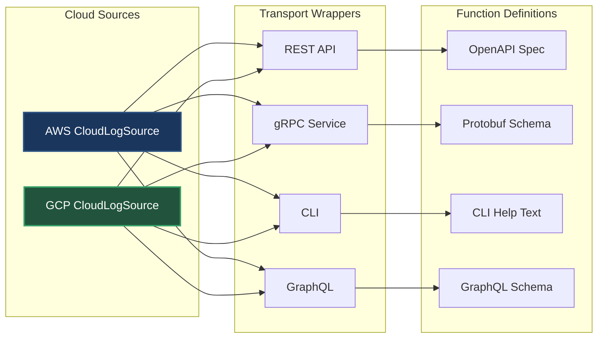

# Phase 5: Transport Chaos - The Server Side

## The New Problem

Function calling is great! But now we need to expose our CloudLogSources to different consumers:

> **Web Team**: "We need REST APIs for our dashboard"
> 
> **Platform Team**: "Everything must be gRPC for our microservices"
> 
> **DevOps**: "Can we get a CLI interface?"
> 
> **Mobile Team**: "What about GraphQL?"

---

## The Multiplication Returns



**The Math**: 2 sources × 4 transports = 8 implementations!

---

## Different Formats for Same Functions

### Our Function Definition
```java
new FunctionDefinition(
    "fetchLogs",
    "Fetch logs from cloud source",
    List.of(
        new Parameter("resource", "string", "Service name"),
        new Parameter("filter", "string", "Log level"),
        new Parameter("limit", "integer", "Max logs")
    )
)
```

### REST: OpenAPI Format
```yaml
/functions/fetchLogs:
  post:
    summary: Fetch logs from cloud source
    requestBody:
      content:
        application/json:
          schema:
            type: object
            properties:
              resource:
                type: string
                description: Service name
              filter:
                type: string
                description: Log level
              limit:
                type: integer
                description: Max logs
    responses:
      200:
        description: Log entries
```

### gRPC: Protobuf Format
```protobuf
service CloudLogSource {
  rpc FetchLogs(FetchLogsRequest) returns (FetchLogsResponse);
}

message FetchLogsRequest {
  string resource = 1;  // Service name
  string filter = 2;    // Log level
  int32 limit = 3;      // Max logs
}

message FetchLogsResponse {
  repeated LogEntry logs = 1;
}
```

### CLI: Argument Format
```bash
cloud-logs fetch --resource payment-service \
                 --filter ERROR \
                 --limit 1000 \
                 --help

Options:
  --resource  Service name (required)
  --filter    Log level: ERROR, WARN, INFO
  --limit     Maximum logs to return
```

---

## The Implementation Explosion

Each transport needs:
- Different authentication methods
- Different error handling
- Different discovery mechanisms
- Different testing approaches
- Different documentation

---

## Speaker Notes

### Opening (1 min)
- Show the team requests for different transports
- "Success brings new challenges"
- "Let's see what this means for our code"

### Code Walkthrough (5 min)

#### First: Show the wrapper classes
1. Open `AWSCloudLogSourceREST.java`
   - Point out the translation logic
   - "Same function, different format"

2. Open `AWSCloudLogSourceGRPC.java`
   - Show protobuf translation
   - "Completely different approach"

3. Count the files needed
   - "2 sources × 4 transports = 8 classes"
   - "Plus all the schema definitions"

#### Second: Show the function translation problem
- Our FunctionDefinition format
- OpenAPI needs different structure
- Protobuf needs .proto files
- Each has different type systems

### Key Messages
- Same functionality, multiple implementations
- Translation complexity for each transport
- Maintenance nightmare as we add sources
- Testing becomes multiplicative

### Transition (30 sec)
"What if we just picked ONE transport format?"

---

## The Path Forward

We need:
1. One transport mechanism
2. One message format
3. One discovery method
4. One error handling approach

This leads to our next insight: **Protocol Standardization**