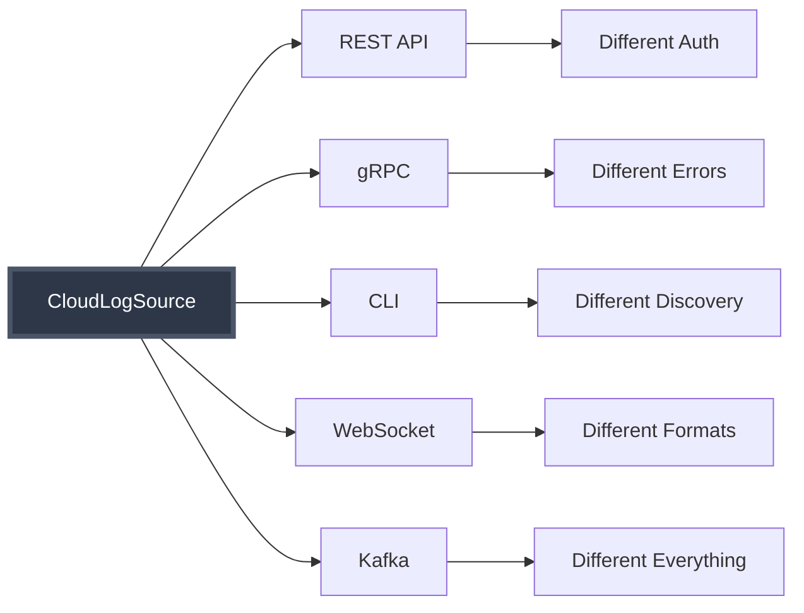
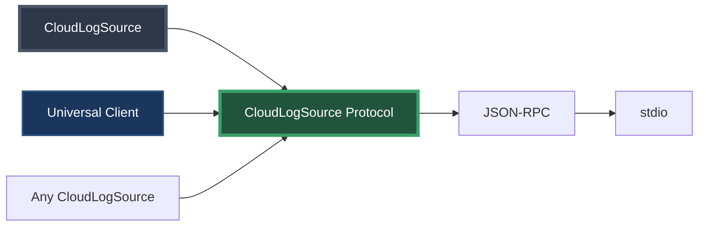

# Phase 6: The Protocol Revelation

## The Insight

Looking at our transport chaos, a realization emerges:

> "What if we just picked ONE way to communicate and made EVERYONE use it?"

---

## From Chaos to Order

### Before: Transport Multiplication


### After: One Protocol to Rule Them All


---

## What Makes It a Protocol?

A protocol isn't just about WHAT you can do (that's an API).
It's about HOW you MUST do it:

1. **Message Format**: JSON-RPC 2.0 (no REST, no protobuf, no XML)
2. **Transport**: stdio only (no HTTP, no TCP, no queues)
3. **Discovery**: Standard "discover" method (no Swagger, no reflection)
4. **Errors**: Standard error codes (no custom formats)
5. **Lifecycle**: Initialize → Discover → Execute (no variations)

---

## The Benefits

### For Source Implementers
- Implement once, work with any client
- No transport-specific code
- Clear specification to follow

### For Client Developers
- One client library for all sources
- Predictable behavior
- No source-specific quirks

### For Users
- Consistent experience
- Easy integration
- Less documentation to read

---

## The Journey We've Taken

1. **Started**: Hardcoded AWS integration
2. **Added**: GCP with copy-paste mess
3. **Abstracted**: Common CloudLogSource interface
4. **Discovered**: Capability advertisement
5. **Multiplied**: Transport explosion
6. **Realized**: We need a protocol!

---

## The Big Reveal

What we've built is exactly the pattern of MCP (Model Context Protocol):

```
Our CloudLogSourceProtocol    →    MCP
- JSON-RPC messages           →    JSON-RPC messages
- stdio transport             →    stdio/SSE transport
- discover method             →    tools/list
- execute method              →    tools/call
- Standard errors             →    Standard errors
```

We didn't set out to build MCP - we arrived here by solving real problems!

---

## Speaker Notes

### Opening (1 min)
1. Start with the question: "What if we picked ONE way?"
2. "This might seem restrictive, but..."
3. "Let's see what happens when we try it"

### Code Walkthrough Order (6 min)

#### First: Show CloudLogSourceProtocol.java
- Walk through the Javadoc specification
- "This defines the rules EVERYONE must follow"
- Point out: message format, transport, methods
- "It's not just an interface - it's a contract"

#### Second: Show protocol message classes
- ProtocolRequest - standard structure
- ProtocolResponse - success or error
- "No variations allowed!"

#### Third: Show a source implementing the protocol
- Open AWSLogSourceProtocolServer
- "Notice how different this is from REST/gRPC versions"
- "All transport concerns handled by the protocol"

#### Fourth: Show the universal client
- CloudLogSourceProtocolClient
- "Works with ANY source that follows the protocol"
- "No source-specific code!"

#### Fifth: Demo the interaction
- Show initialize → discover → execute flow
- "Same client talks to AWS, GCP, Azure"
- "They all speak the same language"

### The MCP Connection (2 min)
1. Show side-by-side comparison
2. "We've essentially built MCP!"
3. "This is why MCP exists - it's the natural solution"

### Key Messages
- Restrictions enable interoperability
- Protocols create ecosystems
- MCP isn't arbitrary - it's what you naturally build

### Transition (30 sec)
"Now let's see how actual MCP works and how similar it is to what we built..."