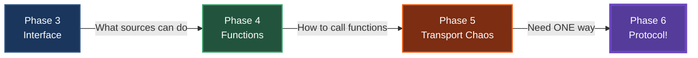
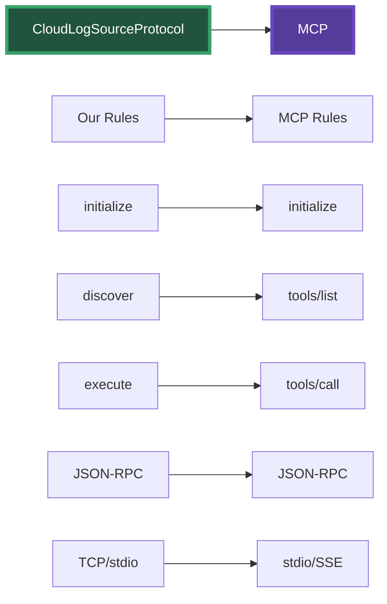

# Phase 6: The Protocol Revelation

## The Big Insight

Looking at our transport chaos, a revolutionary idea emerges:

> "What if we just picked ONE way to communicate and made EVERYONE use it?"

---

## Our Journey of Standardization



We've been building toward this:
1. **Standardized Interface** - CloudLogSource (what they do)
2. **Standardized Functions** - Uniform signatures (how to call)
3. **Now: Standardized Transport** - One way to communicate

---

## What Makes a Protocol?

A protocol isn't just an API. It's a complete specification:

### API vs Protocol
- **API**: "Here's what you can do" (operations)
- **Protocol**: "Here's HOW you MUST do it" (rules)

### Our Protocol Rules
1. **Transport**: TCP sockets (MCP uses stdio)
2. **Format**: JSON-RPC 2.0 only
3. **Lifecycle**: initialize → discover → execute
4. **Errors**: Standard JSON-RPC error codes
5. **Discovery**: Standard method to list capabilities

---

## CloudLogSourceProtocol Specification

```java
/**
 * CloudLogSource Protocol Specification v1.0
 * 
 * TRANSPORT RULES:
 * - Communication uses TCP sockets (MCP standard: stdio)
 * - Each message MUST be a JSON object on a single line
 * - Each message MUST end with newline
 * 
 * MESSAGE FORMAT:
 * - All messages MUST follow JSON-RPC 2.0
 * - Requests: {"jsonrpc":"2.0","method":"...","params":{...},"id":"..."}
 * - Responses: {"jsonrpc":"2.0","result":{...},"id":"..."}
 * 
 * REQUIRED METHODS:
 * 1. initialize - Establish connection
 * 2. discover - List available operations  
 * 3. execute - Perform an operation
 */
```

---

## The Benefits

### Before: Transport Multiplication
- 2 sources × 4 transports = 8 implementations
- Different auth for each
- Different errors for each
- Different discovery for each

### After: One Protocol
- 2 sources × 1 protocol = 2 implementations
- Standard auth negotiation
- Standard error codes
- Standard discovery

---

## The Big Reveal: This IS MCP!



We didn't set out to build MCP - we arrived here by solving real problems!

---

## Live Demo: Multi-Source Protocol

### Setup (2 min)
1. "Let me show you the true power of protocols"
2. Start AWS MCP Server: `mvn exec:java@aws` (runs on port 8001)
3. Start GCP MCP Server: `mvn exec:java@gcp` (runs on port 8002)
4. "Each server implements the CloudLogSourceProtocol interface - real MCP servers!"

### Run Multi-Source Test (5 min)
1. Run WatchTowerAgentProtocolTest
2. "Watch - the agent connects to BOTH servers!"
3. Show function discovery from both sources
4. "The LLM sees AWS.fetchLogs AND GCP.fetchLogs"
5. Point out how LLM chooses which source to query
6. "No cloud-specific imports in the agent!"

### Key Revelation (2 min)
"This is EXACTLY what MCP does:
- Multiple MCP servers (like our AWS/GCP servers)
- One MCP client (like our agent)
- LLM orchestrates across ALL available tools
- Complete decoupling through the protocol"

### The Journey (1 min)
"We didn't set out to build MCP. We just wanted to:
1. Support multiple clouds (Phase 3)
2. Let the LLM orchestrate (Phase 4)
3. Avoid transport chaos (Phase 5)
4. Unify access to all sources (Phase 6)

And we naturally arrived at MCP!"

---

## Speaker Notes

### Opening (2 min)
1. Start with the question: "What if we picked ONE way?"
2. Show our standardization journey
3. "Let's create a protocol!"

### Code Walkthrough (8 min)

#### First: CloudLogSourceProtocol.java
- Walk through the Javadoc specification
- "This isn't just an interface - it's a rulebook"
- Point out: transport rules, message format, lifecycle
- "Everyone MUST follow these rules"

#### Second: Real MCP Server Implementations
- Show AWSCloudLogSourceProtocolServer and GCPCloudLogSourceProtocolServer
- "These are real-world MCP servers - each provider has their own!"
- Show how each implements CloudLogSourceProtocol interface
- "In production, AWS and GCP teams would maintain these servers"
- Point out the three key methods: initialize, discover, execute

#### Third: Protocol Client Architecture
- Show CloudLogSourceProtocolClient interface defining standard methods
- Show CloudLogSourceProtocolClientImpl implementing the interface
- "This client discovers and executes functions from ANY protocol server"
- "Notice: implements both CloudLogSourceProtocolClient (standard protocol) and CloudLogSource (backward compatibility)"
- "No source-specific code - works with any protocol server!"

#### Fourth: Multi-Source Agent
- Show new WatchTowerAgent constructor
- "Connects to MULTIPLE servers simultaneously"
- Walk through the unified function discovery
- "Functions are namespaced: AWS.fetchLogs, GCP.fetchLogs"

#### Fifth: Demo
- Run the protocol test
- Show agent connecting to both servers
- Watch LLM choose between AWS and GCP
- "The same agent code works with any number of sources"

#### Sixth: The MCP Reveal
- Show MCPComparison.java
- Side-by-side comparison
- "We've built MCP!"

### Key Messages (3 min)
- Protocols emerge from real problems
- Restrictions enable interoperability
- Multi-source access is the killer feature
- We built this naturally, not forced
- MCP is the same pattern at scale

### Closing (2 min)
- "You now understand MCP from first principles"
- "It's not magic - it's good engineering"
- "MCP enables AI to use ANY tool through ONE protocol"
- "Go build MCP servers for your tools!"

---

## Technical Deep Dive Points

### Why TCP for the Demo?
- stdio doesn't work across processes in IntelliJ
- TCP shows the same protocol concepts
- Easy to demonstrate multiple connections
- MCP uses stdio for simplicity in production

### The Power of Namespacing
- AWS.fetchLogs vs GCP.fetchLogs
- LLM understands which source to use
- No conflicts between sources
- Natural organization of capabilities

### Process Boundaries
- Each server is a separate process
- True decoupling - could be different languages
- Servers can be remote (just change host/port)
- This is microservices for AI tools!

### The MCP Vision Realized
- One protocol, unlimited tools
- LLMs orchestrate across everything
- No more API integration nightmare
- True composability for AI systems