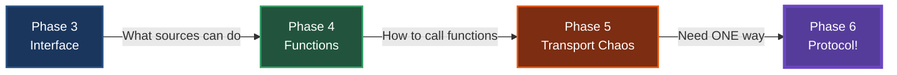
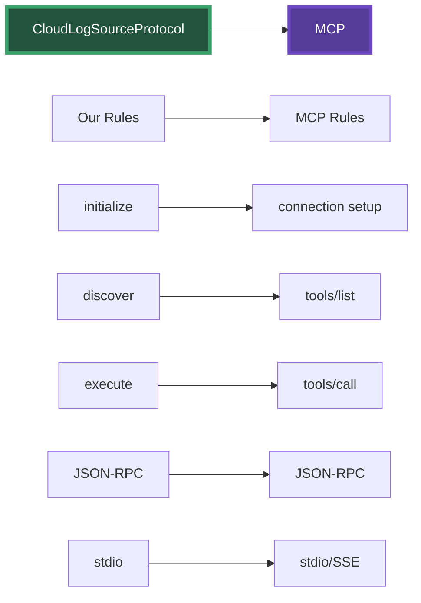

# Phase 6: The Protocol Revelation

## The Big Insight

Looking at our transport chaos, a revolutionary idea emerges:

> "What if we just picked ONE way to communicate and made EVERYONE use it?"

---

## Our Journey of Standardization



We've been building toward this:
1. **Standardized Interface** - CloudLogSource (what they do)
2. **Standardized Functions** - Uniform signatures (how to call)
3. **Now: Standardized Transport** - One way to communicate

---

## What Makes a Protocol?

A protocol isn't just an API. It's a complete specification:

### API vs Protocol
- **API**: "Here's what you can do" (operations)
- **Protocol**: "Here's HOW you MUST do it" (rules)

### Our Protocol Rules
1. **Transport**: stdio only (stdin/stdout)
2. **Format**: JSON-RPC 2.0 only
3. **Lifecycle**: initialize → discover → execute
4. **Errors**: Standard JSON-RPC error codes
5. **Discovery**: Standard method to list capabilities

---

## CloudLogSourceProtocol Specification

```java
/**
 * CloudLogSource Protocol Specification v1.0
 * 
 * TRANSPORT RULES:
 * - Communication MUST use stdio
 * - Each message MUST be a JSON object on a single line
 * - Each message MUST end with newline
 * 
 * MESSAGE FORMAT:
 * - All messages MUST follow JSON-RPC 2.0
 * - Requests: {"jsonrpc":"2.0","method":"...","params":{...},"id":"..."}
 * - Responses: {"jsonrpc":"2.0","result":{...},"id":"..."}
 * 
 * REQUIRED METHODS:
 * 1. initialize - Establish connection
 * 2. discover - List available operations  
 * 3. execute - Perform an operation
 */
```

---

## The Benefits

### Before: Transport Multiplication
- 2 sources × 4 transports = 8 implementations
- Different auth for each
- Different errors for each
- Different discovery for each

### After: One Protocol
- 2 sources × 1 protocol = 2 implementations
- Standard auth negotiation
- Standard error codes
- Standard discovery

---

## The Big Reveal: This IS MCP!



We didn't set out to build MCP - we arrived here by solving real problems!

---

## Speaker Notes

### Opening (2 min)
1. Start with the question: "What if we picked ONE way?"
2. Show our standardization journey
3. "Let's create a protocol!"

### Code Walkthrough (8 min)

#### First: CloudLogSourceProtocol.java
- Walk through the Javadoc specification
- "This isn't just an interface - it's a rulebook"
- Point out: transport rules, message format, lifecycle
- "Everyone MUST follow these rules"

#### Second: Protocol Implementation
- Show CloudLogSourceProtocolServer
- "One implementation, works for any source"
- Show how it wraps ANY CloudLogSource

#### Third: Universal Client
- Show CloudLogSourceProtocolClient
- "This client works with AWS, GCP, any future source"
- "No source-specific code!"

#### Fourth: Demo
- Run the protocol demo
- Show same client talking to different sources
- "They all speak the same language now"

#### Fifth: The MCP Reveal
- Show MCPComparison.java
- Side-by-side comparison
- "We've built MCP!"

### Key Messages (3 min)
- Protocols emerge from real problems
- Restrictions enable interoperability
- We built this naturally, not forced
- MCP is the same pattern at scale

### Closing (2 min)
- "You now understand MCP from first principles"
- "It's not magic - it's good engineering"
- "Go build MCP servers for your tools!"